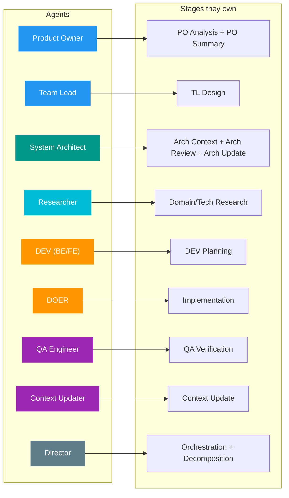

# Task Workflow

Visual reference for the multi-agent task workflow. See [director.md](../.claude/commands/director.md) for full orchestration instructions.

## Diagrams

- **[workflow.mmd](workflow.mmd)** — Standard task workflow (open in VS Code with Mermaid extension)

### Legend

| Color | Meaning |
|-------|---------|
| Blue | Analysis agents (PO, TL) |
| Teal | Architecture governance (arch-context, arch-review, arch-update) |
| Cyan | Research (optional) |
| Orange | Development (planning + implementation) |
| Purple | Mandatory completion sequence (QA, context, summary) |
| Red | Requires user approval (git commit) |
| Green | Terminal state (done) |

---

## Decomposed Task Workflow

For large/complex tasks that are split into subtasks after TL design.

```mermaid
flowchart LR
    subgraph parent ["Parent Task"]
        p_backlog([Backlog])
        p_arch_ctx{Arch<br/>Context?}
        p_po[PO Analysis]
        p_tl[TL Design]
        p_arch_review[Arch Review]
        p_decompose[Decompose]
        p_wait{{Wait for<br/>subtasks}}
        p_qa[Parent QA]
        p_ctx[Context Update]
        p_arch_upd[Arch Update]
        p_summary[PO Summary]
        p_commit[Git Commit]
        p_done([Done])

        p_backlog --> p_arch_ctx
        p_arch_ctx -->|yes/skip| p_po --> p_tl --> p_arch_review
        p_arch_review -->|approved| p_decompose --> p_wait
        p_arch_review -->|rejected| p_tl
        p_wait --> p_qa --> p_ctx --> p_arch_upd --> p_summary --> p_commit --> p_done
    end

    subgraph subtask ["Each Subtask (no architect stages)"]
        s_dev[DEV Planning]
        s_impl[Implementation]
        s_qa[QA Verification]
        s_ctx[Context Update]
        s_commit[Git Commit]
        s_done([Done])

        s_dev --> s_impl --> s_qa --> s_ctx --> s_commit --> s_done
    end

    p_decompose -.->|creates| s_dev
    s_done -.->|reports back| p_wait

    style p_backlog fill:#607D8B,color:#fff,stroke:none
    style p_done fill:#4CAF50,color:#fff,stroke:none
    style s_done fill:#4CAF50,color:#fff,stroke:none
    style p_po fill:#2196F3,color:#fff,stroke:none
    style p_tl fill:#2196F3,color:#fff,stroke:none
    style p_arch_ctx fill:#009688,color:#fff,stroke:none
    style p_arch_review fill:#009688,color:#fff,stroke:none
    style p_arch_upd fill:#009688,color:#fff,stroke:none
    style p_decompose fill:#795548,color:#fff,stroke:none
    style p_wait fill:#795548,color:#fff,stroke:none
    style p_qa fill:#9C27B0,color:#fff,stroke:none
    style p_ctx fill:#9C27B0,color:#fff,stroke:none
    style p_summary fill:#9C27B0,color:#fff,stroke:none
    style p_commit fill:#F44336,color:#fff,stroke:none
    style s_dev fill:#FF9800,color:#fff,stroke:none
    style s_impl fill:#FF9800,color:#fff,stroke:none
    style s_qa fill:#9C27B0,color:#fff,stroke:none
    style s_ctx fill:#9C27B0,color:#fff,stroke:none
    style s_commit fill:#F44336,color:#fff,stroke:none

    style parent fill:none,stroke:#2196F3
    style subtask fill:none,stroke:#FF9800
```



---

## Agent Roles per Stage



---

## Quick Reference

```
Standard:  backlog → arch-ctx? → po → research? → tl → arch-review → research? → dev → impl → qa* → ctx* → arch-upd* → summary* → commit → done
Decomposed Parent:  backlog → arch-ctx? → po → tl → arch-review → decompose → (subtasks) → parent-qa* → ctx* → arch-upd* → summary* → commit → done
Subtask:  dev → impl → qa* → ctx* → commit → done

* = mandatory, automatic
? = optional, Director decides
arch-review = mandatory hard gate (max 2 rejections, then user escalation)
impl = includes mandatory build gate (pnpm lint + test + build must pass before advancing)
Subtasks skip all architect stages
```
