# Mermaid Diagram Syntax for System Architecture Visualization

## Overview

Mermaid is a JavaScript-based diagramming tool that generates diagrams from text-based definitions. It enables "diagram-as-code" workflows where diagrams live in version control alongside code, are reviewed in pull requests, and render directly in GitHub, Markdown documentation, and many other platforms.

For system architecture visualization, Mermaid supports three primary approaches:
1. **Architecture diagrams** (native, v11.1.0+) - Purpose-built for cloud/service architectures
2. **C4 diagrams** (experimental) - Structured approach for software architecture
3. **Flowcharts with subgraphs** - Flexible general-purpose diagrams

## 1. Architecture Diagrams (Recommended for Cloud/Service Architectures)

**Status**: Native support since v11.1.0+ (2024-2025)
**Best for**: IoT systems, cloud deployments, microservices, CI/CD pipelines

### Core Components

Architecture diagrams consist of four elements:

| Element | Purpose | Syntax |
|---------|---------|--------|
| **Services** | Individual components (devices, apps, APIs) | `service id(icon)[label]` |
| **Groups** | Logical grouping containers | `group id(icon)[label]` |
| **Edges** | Connections between components | `source:side arrow side:target` |
| **Junctions** | Four-way connection points | `junction id` |

### Basic Syntax

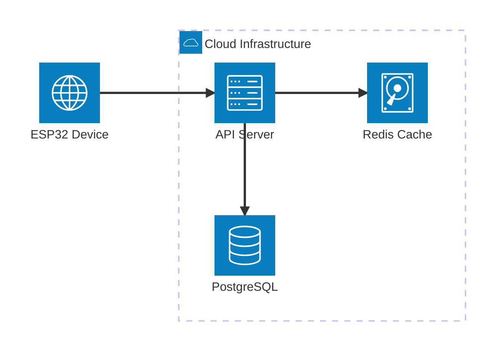

### Service Declaration

```
service {id}({icon})[{label}] (in {parent})?
```

**Examples:**


### Group Declaration (Nesting)

```
group {id}({icon})[{label}] (in {parent})?
```

**Examples:**
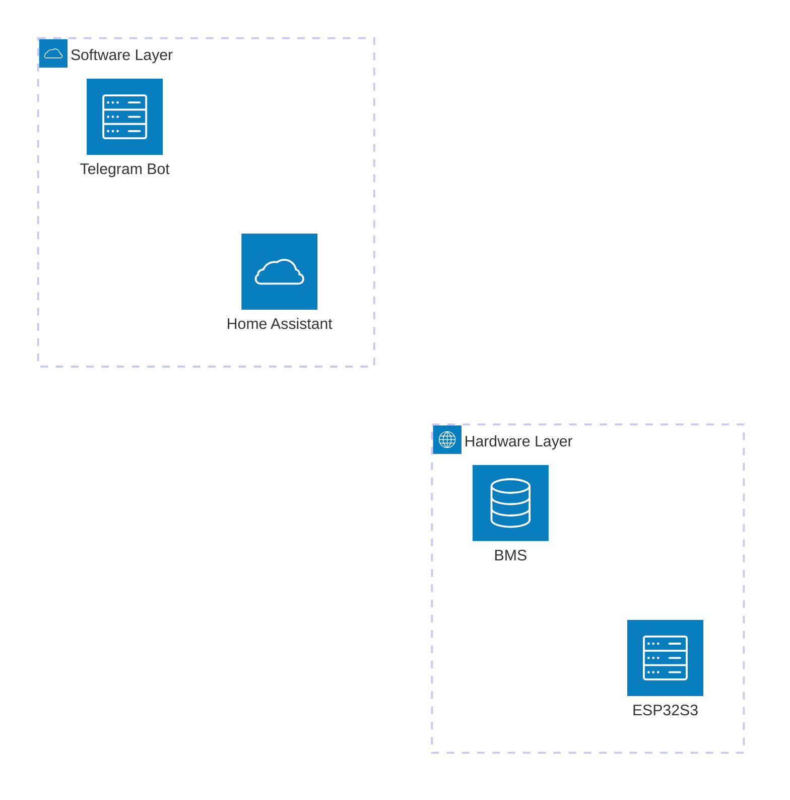

### Edge Syntax (Connections)

```
{source}{group}:{side} {arrow} {side}:{target}{group}
```

**Sides**: `T` (top), `B` (bottom), `L` (left), `R` (right)

**Arrow types**:
- `--` (no arrow, undirected)
- `-->` (rightward arrow)
- `<--` (leftward arrow)
- `<-->` (bidirectional)

**Examples:**
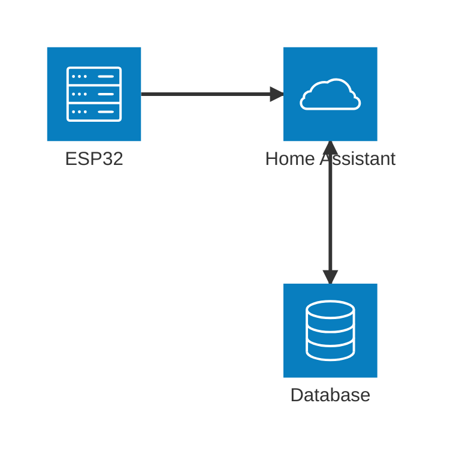

### Representing Communication Protocols

Use edge labels or service names to indicate protocols:


Better approach with descriptive labels in service names:
```
service esp32[ESP32 ← BLE → BMS]
service ha[HA ← WiFi/ESPHome API → ESP32]
```

### Icon Support

**Built-in icons**: `cloud`, `database`, `disk`, `internet`, `server`

**Extended icons (Iconify)**: 200,000+ icons from [iconify.design](https://iconify.design)

Format: `{pack}:{icon-name}`

**Examples:**
```mermaid
architecture-beta
  service esp32(mdi:cpu-32-bit)[ESP32S3]
  service telegram(mdi:send)[Telegram Bot]
  service wifi(mdi:wifi)[WiFi Network]
```

Note: Icon pack integration requires configuration in the rendering environment.

### Complete Architecture Example (Home Automation)


## 2. C4 Diagrams (Experimental)

**Status**: Experimental (syntax may change)
**Best for**: Structured software architecture documentation
**Compatibility**: PlantUML-compatible syntax

C4 (Context, Container, Component, Code) provides a hierarchical approach to architecture documentation.

### Five Diagram Types

| Type | Scope | Use Case |
|------|-------|----------|
| **C4Context** | System-level | External actors and system boundaries |
| **C4Container** | Application-level | Internal applications/services |
| **C4Component** | Module-level | Internal components within containers |
| **C4Dynamic** | Sequence | Interaction flows over time |
| **C4Deployment** | Infrastructure | Physical/virtual deployment topology |

### System Context Diagram

Shows high-level system boundaries and external actors.

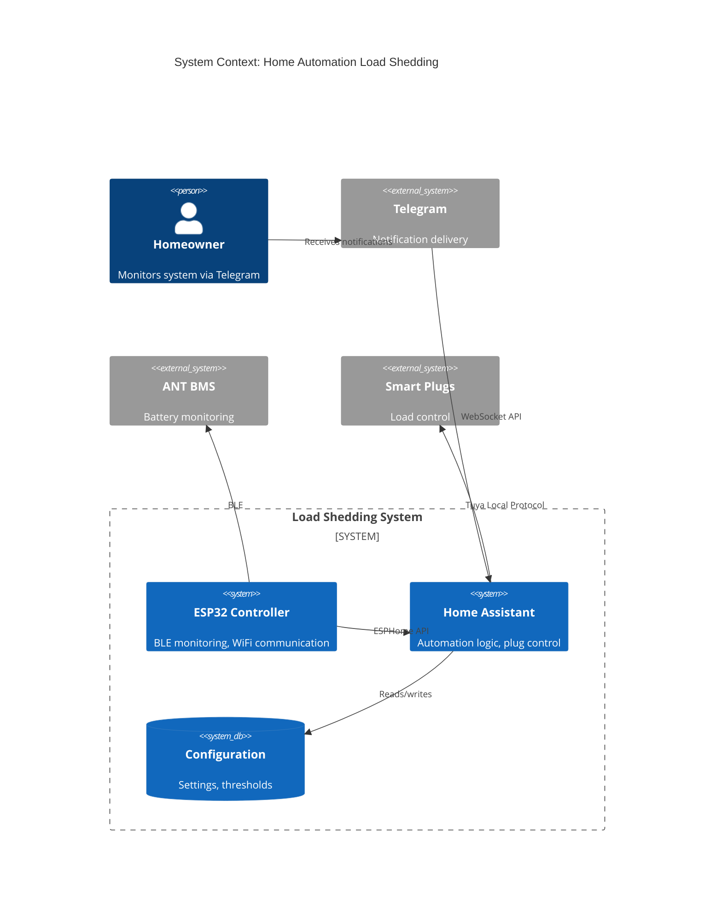

### Container Diagram

Shows internal application containers and technologies.

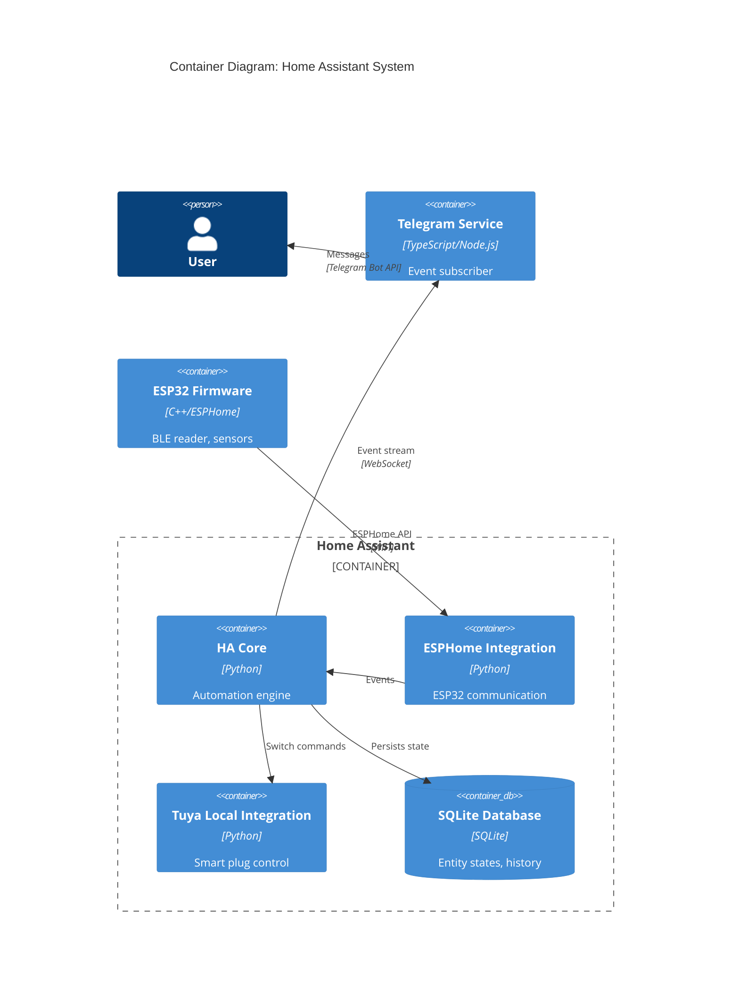

### Component Diagram

Shows internal components within a container.

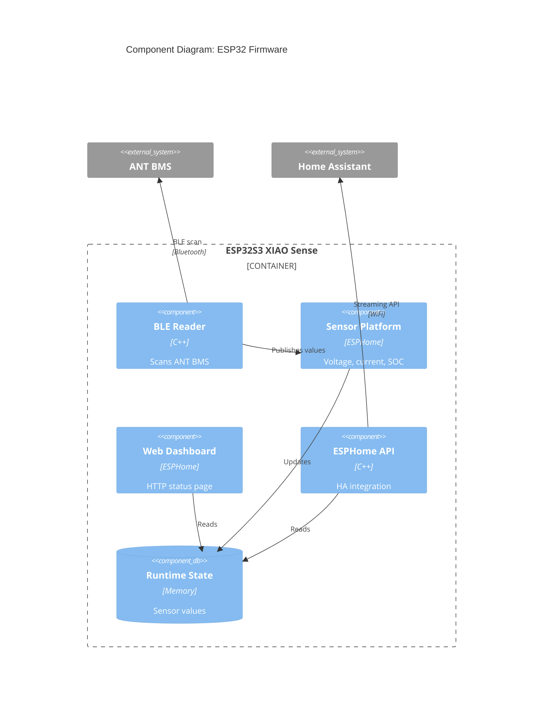

### Dynamic Diagram (Sequence)

Shows interaction sequences over time.

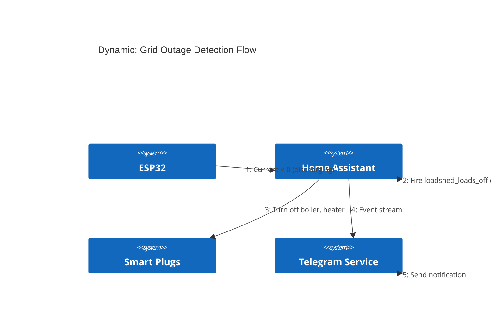

Note: `RelIndex()` ignores the index parameter in current implementations; order matters but numbering doesn't affect rendering.

### Deployment Diagram

Shows physical/virtual infrastructure.

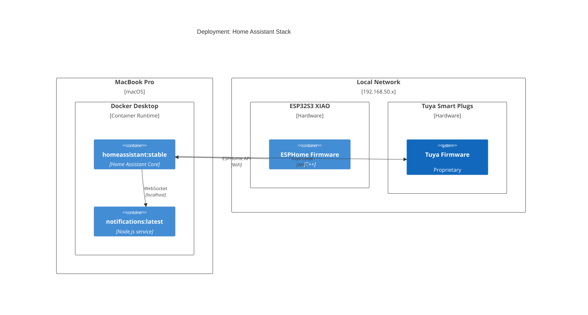

### C4 Styling

```mermaid
C4Context
  UpdateElementStyle(esp32, $bgColor="lightblue", $fontColor="black", $borderColor="navy")
  UpdateRelStyle(esp32, ha, $textColor="blue", $lineColor="blue")
  UpdateLayoutConfig($c4ShapeInRow=3, $c4BoundaryInRow=2)
```

### C4 Limitations

- **Experimental status**: Syntax may change in future releases
- **No layout control**: Cannot use `Lay_U`, `Lay_D`, etc. for explicit positioning
- **Fixed styling**: Themes don't apply; must use `UpdateElementStyle()`
- **Manual positioning**: Element order in code determines layout (vertical by default)

## 3. Flowcharts with Subgraphs

**Status**: Stable, mature feature
**Best for**: Flexible diagrams, custom layouts, mixed hardware/software visualization

### Node Shapes for Architecture

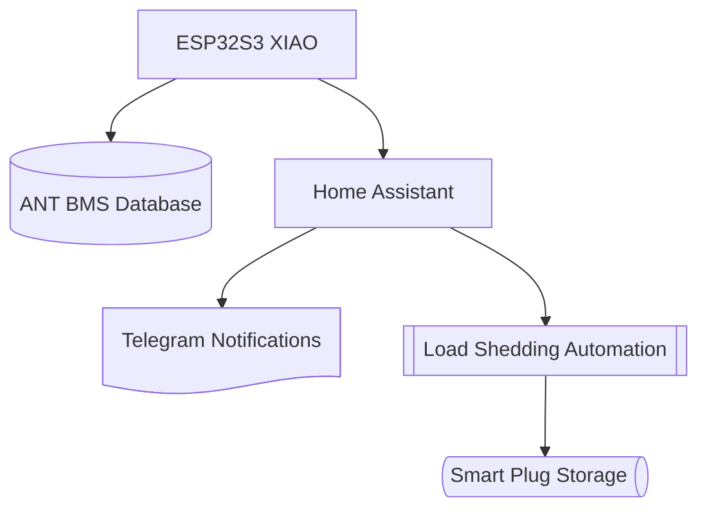

### Subgraph Syntax (Grouping)

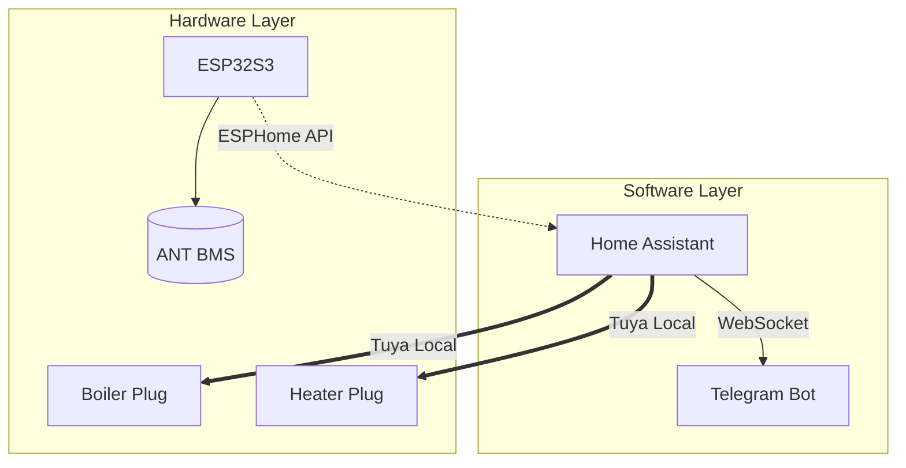

### Connection Types

| Syntax | Style | Use Case |
|--------|-------|----------|
| `A --> B` | Solid arrow | Primary data flow |
| `A -.-> B` | Dotted arrow | Optional/async communication |
| `A ==> B` | Thick arrow | High-bandwidth/critical path |
| `A ---o B` | Circle end | Data termination |
| `A ---x B` | Cross end | Terminated/blocked connection |
| `A <--> B` | Bidirectional | Two-way communication |
| `A --text--> B` | Labeled | Protocol/description |

### Styling with classDef

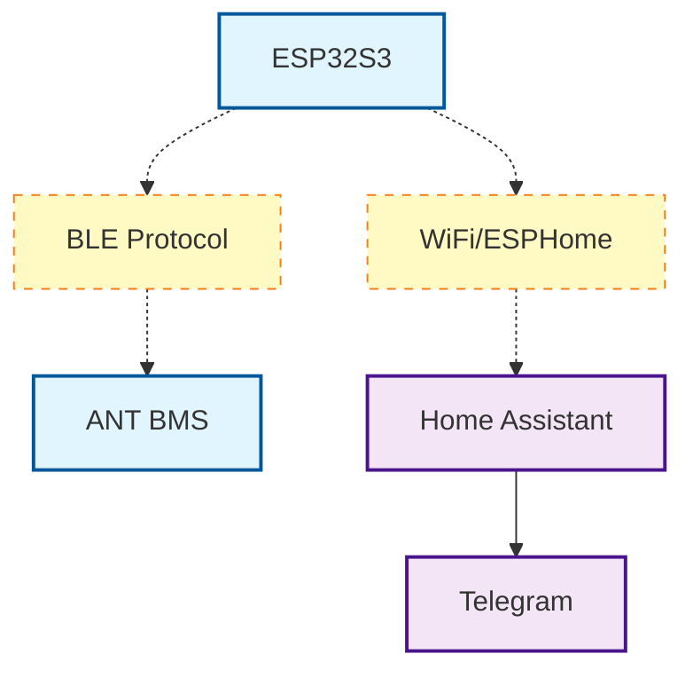

### Direct Node Styling

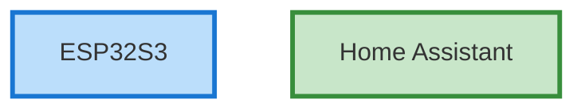

### Complete Flowchart Example

```mermaid
flowchart TB
  classDef hardware fill:#e1f5ff,stroke:#01579b,stroke-width:2px
  classDef software fill:#f3e5f5,stroke:#4a148c,stroke-width:2px
  classDef device fill:#fff3e0,stroke:#e65100,stroke-width:2px

  subgraph hw [Hardware Layer - 192.168.50.x]
    direction TB
    esp32[ESP32S3 XIAO<br/>192.168.50.245]:::hardware
    bms@{ shape: cyl, label: "ANT BMS<br/>(BLE)" }:::hardware

    subgraph plugs [Smart Plugs - Tuya]
      boiler[Boiler<br/>192.168.50.45]:::device
      heater[Heater<br/>192.168.50.236]:::device
    end
  end

  subgraph sw [Software Layer - Docker]
    direction TB
    ha[Home Assistant<br/>localhost:8123]:::software
    telegram[Telegram Service<br/>(TypeScript)]:::software
  end

  bms -.BLE.-> esp32
  esp32 -->|ESPHome API<br/>WiFi| ha
  ha ==>|Tuya Local<br/>WiFi| boiler
  ha ==>|Tuya Local<br/>WiFi| heater
  ha -->|WebSocket<br/>Events| telegram
```

## Comparison: Architecture vs C4 vs Flowchart

| Feature | Architecture | C4 | Flowchart |
|---------|-------------|-----|-----------|
| **Status** | Stable (v11.1.0+) | Experimental | Stable |
| **Learning curve** | Low | Medium | Low |
| **Flexibility** | Medium | Low (structured) | High |
| **Styling** | Limited | Limited | Extensive |
| **Icon support** | Excellent (Iconify) | None | Limited |
| **Grouping** | Groups | Boundaries | Subgraphs |
| **Layout control** | Auto (side-based) | Auto (vertical) | Direction hints |
| **Best for** | Cloud/services | Software architecture | General purpose |

## Best Practices for Readable Architecture Diagrams

### 1. Group Related Components

Use groups (architecture), boundaries (C4), or subgraphs (flowchart) to organize logically related elements.

```mermaid
architecture-beta
  group physical[Physical Devices]
  group logical[Software Services]

  service esp32[ESP32] in physical
  service ha[HA] in logical
```

### 2. Use Descriptive Labels

Include technology/protocol information in labels.

**Good:**
```
service ha[Home Assistant (Docker)]
service esp32[ESP32S3 (ESPHome)]
```

**Bad:**
```
service ha[HA]
service esp32[Controller]
```

### 3. Indicate Communication Protocols

Use edge labels or service descriptions.

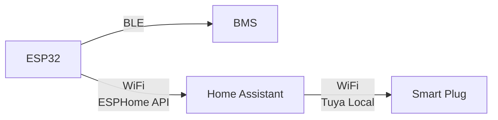

### 4. Show IP Addresses/Endpoints for Hardware

```mermaid
flowchart TB
  esp32[ESP32S3<br/>192.168.50.245]
  boiler[Boiler Plug<br/>192.168.50.45]
  ha[Home Assistant<br/>localhost:8123]
```

### 5. Use Color Coding Consistently

Define a palette and stick to it across diagrams.

```mermaid
flowchart TB
  classDef hardware fill:#e3f2fd,stroke:#1565c0
  classDef software fill:#f3e5f5,stroke:#6a1b9a
  classDef external fill:#fff3e0,stroke:#ef6c00

  esp32:::hardware
  ha:::software
  telegram:::external
```

### 6. Limit Diagram Complexity

**Maximum recommendations:**
- Architecture diagrams: 15-20 services per diagram
- C4 diagrams: 10-15 elements per level
- Flowcharts: 20-25 nodes before splitting

If exceeding these, consider:
- Splitting into multiple diagrams (layers, subsystems)
- Creating zoom-in diagrams for complex areas
- Using C4 hierarchy (Context → Container → Component)

### 7. Direction Hints for Flow

```mermaid
flowchart LR
  %% Use LR for data pipelines
  input --> process --> output

flowchart TB
  %% Use TB for hierarchical architectures
  client --> api --> database
```

### 8. Connection Side Control (Architecture Diagrams)

Specify sides explicitly to avoid crossing edges.

**Good:**
```
esp32:R --> L:ha
ha:B --> T:db
```

**Bad (auto-routing may cross):**
```
esp32 --> ha
ha --> db
```

## Limitations and Known Issues

### Mobile Compatibility

- **GitHub mobile app**: Renders Mermaid as raw code, not diagrams (as of 2026)
- **iOS Safari**: Mixed support; some Obsidian users report rendering failures (iOS <17)
- **Workaround**: Provide static image exports for mobile-critical documentation

### Rendering Issues

1. **Non-deterministic layout** (architecture diagrams): Layout may vary between renders
   - **Mitigation**: Use explicit side declarations (`:L`, `:R`, `:T`, `:B`)

2. **Complex diagram performance**: Large diagrams (50+ nodes) can be slow to render
   - **Mitigation**: Split into multiple diagrams, lazy-load on scroll

3. **VSCode/Claude Code**: Displays raw Mermaid code blocks, requires external viewer
   - **Workaround**: Copy to [mermaid.live](https://mermaid.live) for visualization

### Syntax Limitations

1. **C4 diagrams**: Experimental status means breaking changes possible
2. **Architecture diagrams**: No explicit layout control (no `Lay_*` commands)
3. **Icon limitations**: Custom icons require environment configuration (Iconify integration)
4. **Styling**: More limited than dedicated tools (Lucidchart, draw.io)

### Debugging Tips

- **Silent failures**: Mermaid often fails without error messages
  - Test incrementally: add elements one at a time
  - Validate syntax at [mermaid.live](https://mermaid.live)

- **GitHub rendering**: May work locally but fail on GitHub
  - Check GitHub's supported Mermaid version
  - Avoid bleeding-edge features (e.g., architecture diagrams may not be supported yet)

## Integration with Documentation

### GitHub Markdown

```markdown
```mermaid
flowchart TB
  A --> B
```
```

### MDX (Next.js, Docusaurus)

Install `@mermaid-js/mermaid-cli` or use `remark-mermaid` plugin.

### Static Site Generators

- **Jekyll**: Use `jekyll-mermaid` plugin
- **Hugo**: Use shortcodes or client-side rendering
- **VitePress**: Built-in Mermaid support

### Export to Images

Use `mmdc` (Mermaid CLI) for CI/CD pipelines:

```bash
npm install -g @mermaid-js/mermaid-cli
mmdc -i diagram.mmd -o diagram.png
```

## When to Use Each Diagram Type

| Scenario | Recommended Type | Reason |
|----------|-----------------|---------|
| IoT system with devices + cloud | Architecture | Native icon support, side-based routing |
| Microservices on Kubernetes | Architecture | Group support for namespaces |
| Software architecture documentation | C4 | Structured, hierarchical approach |
| Mixed hardware/software | Flowchart | Flexible styling, custom shapes |
| Data flow pipeline | Flowchart LR | Left-to-right flow natural for pipelines |
| Deployment topology | C4Deployment | Purpose-built for infrastructure |
| Interaction sequences | C4Dynamic or Sequence | Time-based flow representation |

## Example: Complete Home Automation Architecture

### Option 1: Architecture Diagram

```mermaid
architecture-beta
  group hardware(internet)[Hardware - 192.168.50.x]
  group software(cloud)[Software - Docker]

  service esp32(server)[ESP32S3 XIAO<br/>192.168.50.245] in hardware
  service bms(database)[ANT BMS<br/>(BLE)] in hardware
  service boiler(disk)[Boiler Plug<br/>192.168.50.45] in hardware
  service heater(disk)[Heater Plug<br/>192.168.50.236] in hardware

  service ha(cloud)[Home Assistant<br/>localhost:8123] in software
  service telegram(server)[Telegram Service<br/>(TypeScript)] in software

  junction network

  bms:R --> L:esp32
  esp32:T --> B:network
  network:T --> B:ha
  ha:L --> R:boiler
  ha:R --> L:heater
  ha:B --> T:telegram
```

### Option 2: C4 Container Diagram

```mermaid
C4Container
  title Container Diagram: Home Automation Load Shedding

  Person(user, "Homeowner")

  Container_Boundary(hardware, "Hardware Layer") {
    Container(esp32, "ESP32S3 XIAO", "C++/ESPHome", "BLE reader, sensors, web dashboard")
    System_Ext(bms, "ANT BMS", "14S Li-ion battery monitoring")
    Container(boiler, "Boiler Smart Plug", "Tuya", "20A relay, energy monitoring")
    Container(heater, "Heater Smart Plug", "Tuya", "20A relay, energy monitoring")
  }

  Container_Boundary(software, "Software Layer") {
    Container(ha, "Home Assistant", "Python", "Automation engine, plug control, grid detection")
    ContainerDb(hadb, "HA Database", "SQLite", "Entity states, history")
    Container(telegram, "Telegram Service", "TypeScript/Node.js", "Event subscriber, notifications")
  }

  System_Ext(telegram_api, "Telegram Bot API")

  Rel(esp32, bms, "Reads battery state", "BLE")
  Rel(esp32, ha, "Streams sensor data", "ESPHome API/WiFi")
  Rel(ha, hadb, "Persists state")
  Rel(ha, boiler, "Switch control", "Tuya Local/WiFi")
  Rel(ha, heater, "Switch control", "Tuya Local/WiFi")
  Rel(ha, telegram, "Event stream", "WebSocket")
  Rel(telegram, telegram_api, "Send messages", "HTTPS")
  Rel(user, telegram_api, "Receives notifications", "Telegram app")
```

### Option 3: Flowchart with Subgraphs

```mermaid
flowchart TB
  classDef hardware fill:#e1f5ff,stroke:#01579b,stroke-width:2px
  classDef software fill:#f3e5f5,stroke:#4a148c,stroke-width:2px
  classDef device fill:#fff3e0,stroke:#e65100,stroke-width:2px

  subgraph hw [Hardware Layer]
    direction TB
    esp32[ESP32S3 XIAO<br/>192.168.50.245<br/>ESPHome Firmware]:::hardware
    bms@{ shape: cyl, label: "ANT BMS<br/>14S Li-ion<br/>90Ah" }:::hardware

    subgraph plugs [Smart Plugs]
      direction LR
      boiler[Boiler<br/>192.168.50.45<br/>20A Tuya]:::device
      heater[Heater<br/>192.168.50.236<br/>20A Tuya]:::device
    end
  end

  subgraph sw [Software Layer - Docker]
    direction TB
    ha[Home Assistant<br/>localhost:8123<br/>Automation Engine]:::software
    telegram[Telegram Service<br/>TypeScript<br/>Notification Handler]:::software
  end

  user[Homeowner<br/>Telegram Client]

  bms -.BLE<br/>Battery State.-> esp32
  esp32 -->|ESPHome API<br/>WiFi<br/>Sensors| ha
  ha ==>|Tuya Local<br/>WiFi<br/>Switch ON/OFF| boiler
  ha ==>|Tuya Local<br/>WiFi<br/>Switch ON/OFF| heater
  ha -->|WebSocket<br/>loadshed_* events| telegram
  telegram -->|Telegram Bot API<br/>HTTPS| user
```

## Recommendations for Task-022 Subtask 022.1

For the home automation system architecture diagrams, I recommend:

### Primary Diagram: Architecture Diagram

**Why:**
- Native icon support for hardware (server, database, disk)
- Group support for hardware vs. software layers
- Side-based edge routing minimizes crossing connections
- Modern, purpose-built for IoT/cloud systems

**Use for:**
- System overview (hardware + software)
- Current architecture (HA-based control)
- Future architecture (ESP32 autonomous control)

### Secondary Diagrams: C4 Container

**Why:**
- Shows internal structure (containers, technologies)
- Good for documentation and onboarding
- Clearly separates concerns (hardware, software, external)

**Use for:**
- Detailed component breakdown
- Technology stack documentation

### Tertiary Diagrams: Flowcharts

**Why:**
- Flexible for data flow sequences
- Good for showing state transitions
- Custom styling for protocol differentiation

**Use for:**
- Grid detection flow (current < 0 → debounce → trigger)
- Load shedding sequence (detect → wait → turn off → notify)
- WebSocket reconnection flow (disconnect → retry → reconnect)

### Diagram Organization

```
docs/architecture/
├── system-overview.md          # Architecture diagram (current + future)
├── component-details.md        # C4 Container diagram
├── data-flows.md              # Flowcharts (grid detection, load shedding)
└── sequence-diagram.md        # Existing (keep as-is or convert to C4Dynamic)
```

## Sources

- [Building C4 Diagrams in Mermaid](https://lukemerrett.com/building-c4-diagrams-in-mermaid/)
- [C4 Diagrams | Mermaid](https://mermaid.js.org/syntax/c4.html)
- [Architecture Diagrams Documentation | Mermaid](https://mermaid.ai/open-source/syntax/architecture.html)
- [Introducing Architecture Diagrams in Mermaid](https://docs.mermaidchart.com/blog/posts/mermaid-supports-architecture-diagrams)
- [Creating Software Architecture Diagrams with Mermaid](https://medium.com/@somasharma_81597/creating-software-architecture-diagrams-with-mermaid-draw-io-and-chatgpt-4941fbf4c83a)
- [Flowcharts Syntax | Mermaid](https://mermaid.ai/open-source/syntax/flowchart.html)
- [Architecture diagram - different layout rendering each time · Issue #6166](https://github.com/mermaid-js/mermaid/issues/6166)
- [Mermaid Mobile Support · Discussion #11595](https://github.com/orgs/community/discussions/11595)
