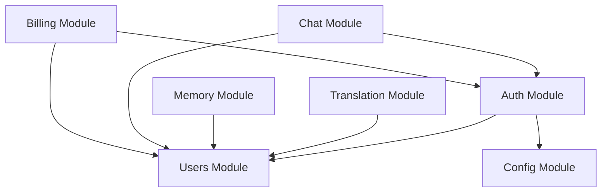

# NestJS Architecture Patterns and Module Organization Best Practices

## Overview

This research compiles comprehensive best practices for architecting medium-sized NestJS applications in 2026. It covers module organization, dependency injection, guard patterns, error handling standardization, and architectural documentation strategies. The focus is on building maintainable, testable, and scalable modular monoliths.

## Key Findings

### 2026 Standard: Modular Monolith Architecture

The 2026 standard for NestJS development is the **Modular Monolith**. NestJS is uniquely suited for this architecture because its `@Module()` decorator enforces logical boundaries within a single codebase. This approach provides:

- **Independent module updates** without impacting the entire application
- **Code reusability** across multiple applications reducing duplication
- **Parallel development** enabling developers to work independently
- **Enhanced testability** through clear module boundaries

### Core Architectural Principles

1. **Feature-Based Modularization** - Group related controllers and providers into modules by domain/feature
2. **Vertical Slice Architecture** - Organize by domain rather than technical layer (avoid /controllers, /services, /dtos)
3. **Unidirectional Dependencies** - Module dependencies must be uni-directional (even if database relationships are bi-directional)
4. **Explicit Boundaries** - Unless explicitly exported, module internals remain private

## Module Organization Patterns

### Recommended Folder Structure

For **medium-sized applications** (like the project), use a modular structure:

```
src/
├── common/                    # Global shared utilities
│   ├── constants/
│   ├── decorators/
│   ├── dto/
│   ├── filters/
│   ├── guards/
│   ├── interceptors/
│   ├── interfaces/
│   ├── middleware/
│   └── pipes/
├── config/                    # Environment configuration
├── modules/                   # Feature modules (domain-driven)
│   ├── auth/
│   │   ├── dto/
│   │   │   ├── login.dto.ts
│   │   │   └── register.dto.ts
│   │   ├── guards/
│   │   │   ├── jwt-auth.guard.ts
│   │   │   └── local-auth.guard.ts
│   │   ├── strategies/
│   │   │   ├── jwt.strategy.ts
│   │   │   └── local.strategy.ts
│   │   ├── auth.controller.ts
│   │   ├── auth.service.ts
│   │   └── auth.module.ts
│   ├── users/
│   │   ├── dto/
│   │   ├── entities/
│   │   ├── users.controller.ts
│   │   ├── users.service.ts
│   │   └── users.module.ts
│   ├── agents/                # LLM pipeline
│   ├── translation/
│   ├── memory/
│   ├── chat/                  # WebSocket
│   └── billing/               # Paddle integration
└── main.ts
```

### Module Best Practices

#### 1. Feature-Based Organization

**DO**: Group by domain/feature
```typescript
// users.module.ts
import { Module } from '@nestjs/common';
import { UsersController } from './users.controller';
import { UsersService } from './users.service';

@Module({
  controllers: [UsersController],
  providers: [UsersService],
  exports: [UsersService],  // Make service available to other modules
})
export class UsersModule {}
```

**DON'T**: Organize by technical layer
```
src/
├── controllers/
├── services/
└── dtos/
```

#### 2. Avoid Deep Nesting

**DO**: Add prefixes/suffixes to reduce depth
```
src/modules/
├── user-profile/
├── user-settings/
└── user-preferences/
```

**DON'T**: Create deep hierarchies
```
src/modules/
└── users/
    └── profile/
        └── settings/
            └── preferences/
```

#### 3. Shared Modules Pattern

For utilities used across multiple features:

```typescript
// shared.module.ts
import { Module, Global } from '@nestjs/common';
import { EmailService } from './email.service';

@Global()  // Makes module globally available
@Module({
  providers: [EmailService],
  exports: [EmailService],
})
export class SharedModule {}
```

**Key Rule**: A service is only available where it's provided AND exported.

```typescript
// WRONG: Not exported
@Module({
  providers: [EmailService],
  // Missing exports!
})

// CORRECT: Explicitly exported
@Module({
  providers: [EmailService],
  exports: [EmailService],  // Now available to importing modules
})
```

## Dependency Injection Best Practices

### Provider Basics

```typescript
// Mark class as injectable
@Injectable()
export class UsersService {
  constructor(
    private readonly prisma: PrismaService,  // Constructor injection
  ) {}

  async findOne(id: string): Promise<User> {
    return this.prisma.user.findUnique({ where: { id } });
  }
}
```

### Provider Scopes

| Scope | Behavior | Use Case |
|-------|----------|----------|
| **DEFAULT (Singleton)** | Single instance shared across application | Stateless services, database connections |
| **REQUEST** | New instance per request | Request-specific context |
| **TRANSIENT** | New instance per injection | Stateful services |

**Best Practice**: Use DEFAULT scope unless you have specific requirements.

### Shared Module Visibility

```typescript
// config.module.ts
@Module({
  providers: [ConfigService],
  exports: [ConfigService],  // REQUIRED for sharing
})
export class ConfigModule {}

// users.module.ts
@Module({
  imports: [ConfigModule],  // Now UsersModule can inject ConfigService
  controllers: [UsersController],
  providers: [UsersService],
})
export class UsersModule {}
```

**Critical Rule**: NestJS treats each module as a black box. Unless you explicitly `export` providers, other modules cannot see them.

## Circular Dependencies

### What They Are

Circular dependency occurs when two classes depend on each other:
- **Module-level**: Module A imports Module B, and Module B imports Module A
- **Provider-level**: Service A injects Service B, and Service B injects Service A

### Why They're Problematic

- Creates **tight coupling** between modules/classes
- Forces **recompilation** of both when either changes
- Makes code **difficult to test and reuse**
- Is a **code smell** indicating architectural issues

### Key Architectural Principle

> **Database relationships can be bi-directional. Module dependencies must be uni-directional.**

Example:
- Database: An `Author` has many `Books`, a `Book` has one `Author` ✅
- Modules: `AuthorModule` exposes `AuthorService` consumed by `BookModule` ✅
- Anti-pattern: `AuthorModule` and `BookModule` depend on each other ❌

### Best Practices to Avoid Circular Dependencies

#### 1. Extract Common Logic

**WRONG**:
```typescript
// user.service.ts
@Injectable()
export class UserService {
  constructor(private fileService: FileService) {}
}

// file.service.ts
@Injectable()
export class FileService {
  constructor(private userService: UserService) {}  // CIRCULAR!
}
```

**CORRECT**:
```typescript
// profile-picture.service.ts
@Injectable()
export class ProfilePictureService {
  constructor(
    private userService: UserService,
    private fileService: FileService,
  ) {}
}
```

#### 2. Create Shared Modules

If both services need a single method, extract it to a utility module:

```typescript
// image-utils.module.ts
@Module({
  providers: [ImageUtilsService],
  exports: [ImageUtilsService],
})
export class ImageUtilsModule {}
```

#### 3. Use Event-Driven Architecture

**Instead of direct dependencies**:
```typescript
// user.service.ts (WRONG)
constructor(private emailService: EmailService) {}

async create(dto: CreateUserDto) {
  const user = await this.save(dto);
  await this.emailService.sendWelcome(user);  // Direct dependency
}
```

**Use EventEmitter2**:
```typescript
// user.service.ts (CORRECT)
constructor(private eventEmitter: EventEmitter2) {}

async create(dto: CreateUserDto) {
  const user = await this.save(dto);
  this.eventEmitter.emit('user.created', user);  // Decoupled
}

// email.service.ts
@OnEvent('user.created')
async handleUserCreated(user: User) {
  await this.sendWelcome(user);
}
```

#### 4. Last Resort: forwardRef()

When circular dependencies **absolutely cannot be avoided**:

```typescript
// users.module.ts
@Module({
  imports: [forwardRef(() => AuthModule)],
})
export class UsersModule {}

// auth.module.ts
@Module({
  imports: [forwardRef(() => UsersModule)],
})
export class AuthModule {}
```

**Warning**: `forwardRef()` is a lazy evaluation tool for runtime resolution. It should be your **last resort**, not a catch-all. Architectural refactoring is the preferred solution.

## Guard Patterns

### Guard Execution Order

```
Middleware → Guards → Interceptors (before) → Route Handler → Interceptors (after) → Filters
```

Guards are executed in the order they are bound:
```typescript
@UseGuards(JwtAuthGuard, RolesGuard)  // JwtAuthGuard runs first
```

### JwtAuthGuard Implementation

Basic implementation:
```typescript
import { Injectable } from '@nestjs/common';
import { AuthGuard } from '@nestjs/passport';

@Injectable()
export class JwtAuthGuard extends AuthGuard('jwt') {}
```

Advanced with custom error handling:
```typescript
import { ExecutionContext, Injectable, UnauthorizedException } from '@nestjs/common';
import { AuthGuard } from '@nestjs/passport';
import { Observable } from 'rxjs';

@Injectable()
export class JwtAuthGuard extends AuthGuard('jwt') {
  canActivate(context: ExecutionContext): boolean | Promise<boolean> | Observable<boolean> {
    return super.canActivate(context);
  }

  handleRequest(err: any, user: any, info: any): any {
    if (err || !user) {
      throw err || new UnauthorizedException('User is not authorized');
    }
    return user;
  }
}
```

### RoleGuard Implementation

Uses Reflector to access role metadata:

```typescript
import { CanActivate, ExecutionContext, Injectable } from '@nestjs/common';
import { Reflector } from '@nestjs/core';

export const ROLES_KEY = 'roles';

@Injectable()
export class RolesGuard implements CanActivate {
  constructor(private reflector: Reflector) {}

  canActivate(context: ExecutionContext): boolean {
    const requiredRoles = this.reflector.getAllAndOverride<string[]>(ROLES_KEY, [
      context.getHandler(),
      context.getClass(),
    ]);

    if (!requiredRoles) {
      return true;  // No roles required
    }

    const request = context.switchToHttp().getRequest();
    const user = request.user;  // Set by JwtAuthGuard

    return requiredRoles.some((role) => user.roles?.includes(role));
  }
}
```

Custom decorator for roles:
```typescript
import { SetMetadata } from '@nestjs/common';

export const ROLES_KEY = 'roles';
export const Roles = (...roles: string[]) => SetMetadata(ROLES_KEY, roles);
```

### Guard Usage Example

```typescript
@Controller('users')
export class UsersController {
  @Get('profile')
  @UseGuards(JwtAuthGuard)  // Authentication only
  getProfile(@Request() req) {
    return req.user;
  }

  @Delete(':id')
  @Roles('admin')
  @UseGuards(JwtAuthGuard, RolesGuard)  // Auth + Authorization
  deleteUser(@Param('id') id: string) {
    return this.usersService.delete(id);
  }
}
```

### Guard Best Practices

1. **Apply guards only when necessary** - Keep routes open if they don't require protection
2. **Use global guards for authentication** - Ensures all routes check authentication by default
3. **Combine guards for layered security** - Use middleware for sanitization, guards for access control
4. **Return 404 for unauthorized resource access** - Prevents ID enumeration attacks

```typescript
// CORRECT: Prevents ID enumeration
const resource = await this.prisma.translation.findFirst({
  where: {
    id: resourceId,
    userId,  // Ownership check in query
  },
});

if (!resource) {
  throw new NotFoundException('Translation not found');  // 404 for both cases
}

// WRONG: Reveals that resource exists
const resource = await this.prisma.translation.findUnique({ where: { id } });
if (resource.userId !== userId) {
  throw new ForbiddenException();  // 403 leaks info
}
```

## Exception Handling and Error Response Standardization

### Global Exception Filter

Centralizes error handling across the application:

```typescript
import { ExceptionFilter, Catch, ArgumentsHost, HttpException, HttpStatus } from '@nestjs/common';

@Catch()
export class AllExceptionsFilter implements ExceptionFilter {
  catch(exception: unknown, host: ArgumentsHost) {
    const ctx = host.switchToHttp();
    const response = ctx.getResponse();
    const request = ctx.getRequest();

    const status = exception instanceof HttpException
      ? exception.getStatus()
      : HttpStatus.INTERNAL_SERVER_ERROR;

    const message = exception instanceof HttpException
      ? exception.message
      : 'Internal server error';

    response.status(status).json({
      statusCode: status,
      message,
      timestamp: new Date().toISOString(),
      path: request.url,
    });
  }
}
```

Register globally in `main.ts`:
```typescript
import { NestFactory } from '@nestjs/core';
import { AppModule } from './app.module';
import { AllExceptionsFilter } from './common/filters/all-exceptions.filter';

async function bootstrap() {
  const app = await NestFactory.create(AppModule);
  app.useGlobalFilters(new AllExceptionsFilter());
  await app.listen(3000);
}
bootstrap();
```

### Built-in HTTP Exceptions

NestJS provides ready-to-use exception classes:

```typescript
import {
  BadRequestException,
  NotFoundException,
  UnauthorizedException,
  ForbiddenException,
  ConflictException,
  InternalServerErrorException,
} from '@nestjs/common';

// Usage examples
throw new NotFoundException(`User with ID ${id} not found`);
throw new UnauthorizedException('Invalid credentials');
throw new BadRequestException('Invalid input data');
throw new ConflictException('Email already exists');
```

### Custom Domain Exceptions

Extend base HTTP exceptions for business logic clarity:

```typescript
// duplicated-email.exception.ts
import { BadRequestException } from '@nestjs/common';

export class DuplicatedEmailException extends BadRequestException {
  constructor(email: string) {
    super(`The email ${email} is already registered`);
  }
}

// Usage in service
async register(dto: RegisterDto) {
  const exists = await this.findByEmail(dto.email);
  if (exists) {
    throw new DuplicatedEmailException(dto.email);
  }
  // ...
}
```

### Standardized Response Format

Consistent error responses include:

```typescript
{
  "statusCode": 404,
  "message": "User with ID 123 not found",
  "timestamp": "2026-01-29T12:00:00.000Z",
  "path": "/users/123"
}
```

### Validation Integration

Use `ValidationPipe` with `class-validator` DTOs:

```typescript
// main.ts
import { ValidationPipe } from '@nestjs/common';

async function bootstrap() {
  const app = await NestFactory.create(AppModule);
  app.useGlobalPipes(new ValidationPipe({
    whitelist: true,  // Strip non-whitelisted properties
    forbidNonWhitelisted: true,  // Throw error if non-whitelisted properties present
    transform: true,  // Auto-transform payloads to DTO instances
  }));
  await app.listen(3000);
}
```

DTO with validation:
```typescript
import { IsString, IsEmail, IsNotEmpty, MinLength } from 'class-validator';

export class CreateUserDto {
  @IsString()
  @IsNotEmpty()
  readonly name: string;

  @IsEmail()
  @IsNotEmpty()
  readonly email: string;

  @IsString()
  @MinLength(8)
  readonly password: string;
}
```

Automatically responds with 400 Bad Request when constraints fail:
```json
{
  "statusCode": 400,
  "message": [
    "password must be longer than or equal to 8 characters"
  ],
  "error": "Bad Request"
}
```

### Layered Error Handling Defense

| Layer | Purpose | Example |
|-------|---------|---------|
| **DTOs** | Define data contract | `CreateUserDto` with validation decorators |
| **Pipes** | Enforce and transform inputs | `ValidationPipe`, `ParseIntPipe` |
| **Guards** | Control access | `JwtAuthGuard`, `RolesGuard` |
| **Interceptors** | Shape responses, monitor | Logging, transformation |
| **Filters** | Catch and format errors | `AllExceptionsFilter` |

## DTOs (Data Transfer Objects)

### Purpose

DTOs define the shape of data for:
- **Input validation** - Ensure incoming data meets requirements
- **Type safety** - Provide compile-time type checking
- **API documentation** - Auto-generate Swagger/OpenAPI schemas
- **Data transformation** - Control what data flows between layers

### Basic Structure

```typescript
// create-user.dto.ts
import { IsString, IsEmail, IsNotEmpty, MinLength } from 'class-validator';

export class CreateUserDto {
  @IsString()
  @IsNotEmpty()
  readonly name: string;

  @IsEmail()
  @IsNotEmpty()
  readonly email: string;

  @IsString()
  @MinLength(8)
  readonly password: string;
}
```

### Update DTO Pattern

Use `PartialType` to make all fields optional:

```typescript
import { PartialType } from '@nestjs/mapped-types';
import { CreateUserDto } from './create-user.dto';

export class UpdateUserDto extends PartialType(CreateUserDto) {}
```

### Response DTO Pattern

Control what data is exposed in responses:

```typescript
// user-response.dto.ts
import { Exclude, Expose } from 'class-transformer';

export class UserResponseDto {
  @Expose()
  id: string;

  @Expose()
  name: string;

  @Expose()
  email: string;

  @Exclude()  // Don't expose password
  passwordHash: string;

  @Expose()
  createdAt: Date;
}
```

### Folder Organization

Group DTOs by module:
```
src/modules/
└── users/
    ├── dto/
    │   ├── create-user.dto.ts
    │   ├── update-user.dto.ts
    │   └── user-response.dto.ts
    ├── users.controller.ts
    ├── users.service.ts
    └── users.module.ts
```

## Documenting NestJS Architecture

### Architecture Decision Records (ADRs)

Document significant architectural decisions using ADRs. At minimum, each ADR should include:

1. **Title** - Short descriptive name
2. **Status** - Proposed, Accepted, Deprecated, Superseded
3. **Context** - What is the issue we're addressing?
4. **Decision** - What architectural decision did we make?
5. **Consequences** - What are the trade-offs and impacts?

Example ADR structure:
```markdown
# ADR-001: Use Modular Monolith Architecture

## Status
Accepted

## Context
the project is a medium-sized application with multiple domains (Auth, Users, Agents, Translation, Memory, Chat, Billing). We need to balance maintainability with deployment simplicity.

## Decision
We will structure the NestJS API as a Modular Monolith with clear module boundaries enforced by the @Module() decorator.

## Consequences
**Positive:**
- Simpler deployment (single application)
- Easier transactions across domains
- Clear module boundaries via NestJS
- Can extract microservices later if needed

**Negative:**
- All modules deploy together
- Requires discipline to maintain boundaries
- Scaling requires scaling entire application
```

### Module Documentation

Each module should have a `README.md` documenting:

1. **Purpose** - What does this module do?
2. **Exports** - What services/providers are exposed?
3. **Dependencies** - What other modules does it import?
4. **Key Flows** - Main use cases and data flows

Example:
```markdown
# Auth Module

## Purpose
Handles user authentication and authorization using JWT tokens.

## Exports
- `AuthService` - Login, register, token validation
- `JwtAuthGuard` - Protect routes requiring authentication
- `RolesGuard` - Protect routes requiring specific roles

## Dependencies
- `UsersModule` - User data access
- `ConfigModule` - JWT secrets and configuration
- `PassportModule` - Authentication strategies

## Key Flows
1. Register: `POST /auth/register` → Create user → Return tokens
2. Login: `POST /auth/login` → Validate credentials → Return tokens
3. Refresh: `POST /auth/refresh` → Validate refresh token → Return new access token
```

### Mermaid Diagrams

Use Mermaid for visualizing module relationships and data flows:



## Project Integration: the project Architecture Audit

### Current Architecture Assessment

the project has these modules:
- **Auth** - User authentication (JWT)
- **Users** - User profile management
- **Agents** - LLM pipeline (Claude API)
- **Translation** - Message translation history
- **Memory** - User memory storage

Upcoming modules:
- **Chat** - WebSocket real-time communication
- **Billing** - Paddle payment integration

### Recommended Audit Checklist

#### 1. Module Boundaries
- [ ] Are module dependencies unidirectional?
- [ ] Are all shared services properly exported?
- [ ] Are there any circular dependencies?
- [ ] Does each module have a clear, single responsibility?

#### 2. Dependency Injection
- [ ] Are providers properly scoped (DEFAULT/REQUEST/TRANSIENT)?
- [ ] Are shared utilities extracted to a common/shared module?
- [ ] Are all injectable classes marked with `@Injectable()`?

#### 3. Guard Implementation
- [ ] Is `JwtAuthGuard` used consistently across protected routes?
- [ ] Are role-based guards implemented correctly?
- [ ] Are guards returning 404 for unauthorized resource access (not 403)?
- [ ] Is there a trial expiration guard (if needed)?

#### 4. Error Handling
- [ ] Is there a global exception filter?
- [ ] Are custom domain exceptions used for business logic errors?
- [ ] Is error response format standardized across all endpoints?
- [ ] Are validation errors handled by `ValidationPipe`?

#### 5. DTOs
- [ ] Do all controller methods use DTOs for input validation?
- [ ] Are update DTOs using `PartialType`?
- [ ] Are response DTOs used to control exposed data?
- [ ] Are DTOs organized in `dto/` folders within each module?

#### 6. Code Organization
- [ ] Are modules organized by domain/feature (not technical layer)?
- [ ] Is folder nesting kept shallow (2-3 levels max)?
- [ ] Are common utilities in `common/` or `shared/`?
- [ ] Is configuration centralized in `config/`?

#### 7. Documentation
- [ ] Does each module have a README explaining its purpose?
- [ ] Are architectural decisions documented in ADRs?
- [ ] Are module relationships visualized (e.g., Mermaid diagrams)?

### Integration Patterns for Upcoming Modules

#### Chat Module (WebSocket)
```typescript
// chat.module.ts
@Module({
  imports: [
    AuthModule,  // For JWT validation in WebSocket
    UsersModule,  // For user data
  ],
  providers: [ChatGateway, ChatService],
  exports: [ChatService],
})
export class ChatModule {}
```

**Considerations**:
- WebSocket authentication via JWT
- Real-time message broadcasting
- Connection state management

#### Billing Module (Paddle)
```typescript
// billing.module.ts
@Module({
  imports: [
    UsersModule,  // For subscription status
    AuthModule,   // For protected routes
    ConfigModule, // For Paddle API keys
  ],
  controllers: [BillingController, WebhookController],
  providers: [BillingService, PaddleService],
  exports: [BillingService],
})
export class BillingModule {}
```

**Considerations**:
- Webhook signature verification
- Subscription status tracking
- Trial expiration guard
- Payment flow error handling

## Sources

- [Best Practices for Structuring a NestJS Application](https://arnab-k.medium.com/best-practices-for-structuring-a-nestjs-application-b3f627548220)
- [NestJS Module Best Practices for Clean Code Organization](https://blog.bytescrum.com/nestjs-module-best-practices-for-clean-code-organization)
- [Nest.js and Modular Architecture: Principles and Best Practices](https://levelup.gitconnected.com/nest-js-and-modular-architecture-principles-and-best-practices-806c2cb008d5)
- [Building Enterprise-Grade NestJS Applications: A Clean Architecture Template](https://v-checha.medium.com/building-enterprise-grade-nestjs-applications-a-clean-architecture-template-ebcb6462c692)
- [Error Handling in NestJS: Best Practices and Examples](https://dev.to/geampiere/error-handling-in-nestjs-best-practices-and-examples-5e76)
- [NestJS Error Handling Patterns](https://betterstack.com/community/guides/scaling-nodejs/error-handling-nestjs/)
- [NestJS Cheat Sheet: DTOs, Entities, Controllers, Modules & Services](https://medium.com/@imtiaznayim95/nestjs-cheat-sheet-dtos-entities-controllers-modules-services-89cf316386be)
- [Role-Based Authorization with JWT Using NestJS](https://shpota.com/2022/07/16/role-based-authorization-with-jwt-using-nestjs.html)
- [Understanding Circular Dependency in NestJS](https://www.digitalocean.com/community/tutorials/understanding-circular-dependency-in-nestjs)
- [How to avoid circular dependencies in NestJS](https://blog.logrocket.com/avoid-circular-dependencies-nestjs/)
- [Avoiding Circular Dependencies in NestJS](https://trilon.io/blog/avoiding-circular-dependencies-in-nestjs)
- [Understanding Providers and Dependency Injection in NestJS](https://dev.to/patrick0806/understanding-providers-and-dependency-injection-in-nestjs-248e)
- [The Ultimate Guide to Dependency Injection in NestJS](https://shreyashupare.medium.com/nestjs-dependency-injection-c7262963560f)
