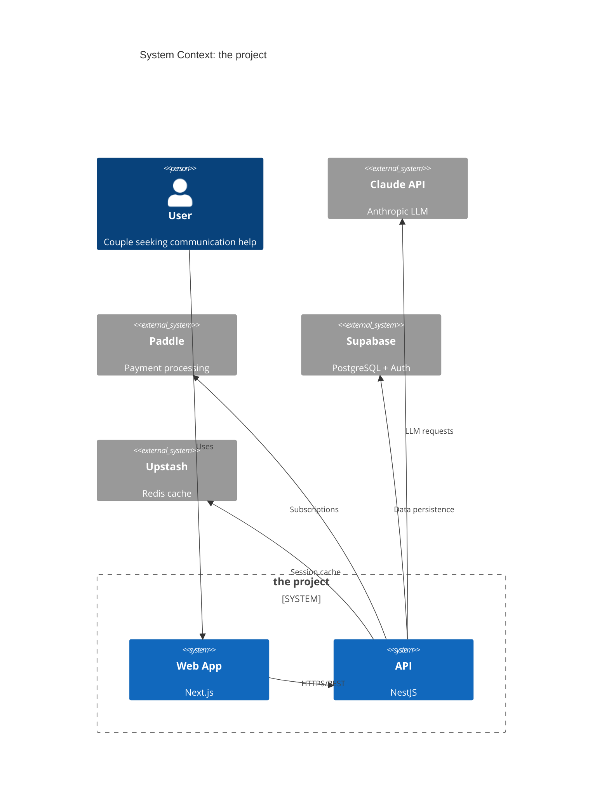
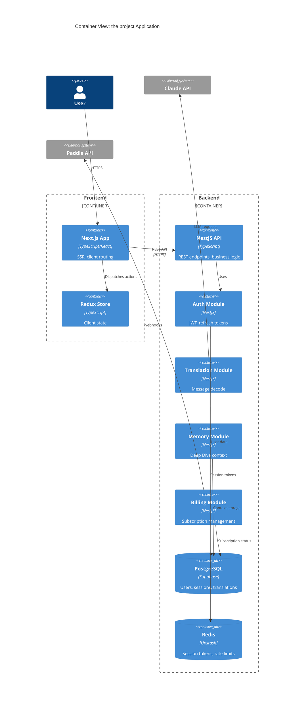
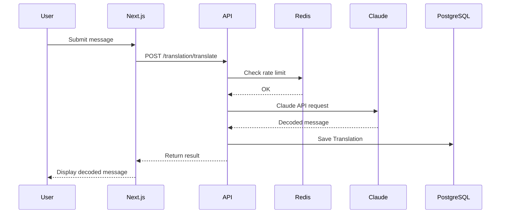
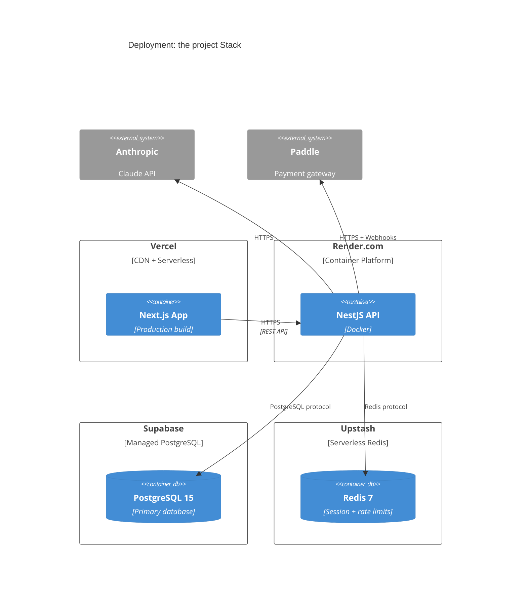

# Architecture Documentation Patterns for Retroactive ADRs (Task-011)

## Overview

This research provides practical guidance for task-011: retroactively documenting architecture decisions for 6 completed backend modules in the project (auth, pipeline, validation, memory, enums, security, testing, rate limiting). The goal is to create ~9 ADRs covering decisions already implemented, plus architecture overview and gap analysis documents.

**Key Challenge:** Writing ADRs *after* implementation (retroactive/brownfield documentation) rather than during decision-making.

## 1. Writing Retroactive ADRs for Brownfield Workloads

### What Makes Retroactive ADRs Different

| Aspect | Proactive ADR | Retroactive ADR |
|--------|---------------|-----------------|
| **Timing** | Before/during implementation | After implementation |
| **Context** | Real-time decision drivers | Reconstructed from code/commits |
| **Alternatives** | Genuinely evaluated | Inferred from what wasn't chosen |
| **Consequences** | Predicted outcomes | Observed actual outcomes |
| **Status** | Often "proposed" → "accepted" | Always "accepted" (already implemented) |

### Best Practices for Retroactive ADRs

#### 1. Mine Context from Git History

**Sources of context:**
- Commit messages (e.g., "Add bcrypt password hashing")
- PR descriptions and review comments
- Issue discussions (GitHub, Jira, Slack references)
- Code comments explaining "why" (not just "what")
- Related tasks in TaskMaster (e.g., task-003, task-005)

**Example:**
```markdown
## Context and Problem Statement

During task-003 (user authentication), we needed to store user passwords
securely. Git history (commit 7c54638) shows initial implementation used
plain text storage, which was immediately replaced with bcrypt hashing
before production deployment.

How should we securely store and verify user passwords?
```

#### 2. Reconstruct Decision Drivers from Requirements

**Technique:** Reverse-engineer drivers from:
- PRD requirements (docs/prd.md sections)
- Security best practices (OWASP, NestJS guidelines)
- Performance constraints (API response time targets)
- Tech stack constraints (already using NestJS, Prisma)

**Example:**
```markdown
## Decision Drivers

* Must protect against password database breaches (security requirement)
* Must comply with OWASP password storage guidelines
* Team familiar with bcrypt from prior projects (expertise)
* NestJS ecosystem has mature bcrypt integration
* Cannot use Argon2 (Node.js native module compatibility issues on macOS)
```

#### 3. Infer Alternatives from What Wasn't Chosen

**Technique:** Research industry-standard alternatives, even if never formally considered:

```markdown
## Considered Options

* bcrypt (chosen)
* Argon2 (winner of Password Hashing Competition 2015)
* PBKDF2 with SHA-256 (NIST recommended)
* scrypt (memory-hard function)

Note: While not all options were formally evaluated during implementation,
these represent industry-standard alternatives for password hashing.
```

**Honesty clause:** Add note explaining retroactive nature:
```markdown
## More Information

**Retroactive Documentation:** This ADR was written after implementation
(2026-01-29) to document decisions made during task-003. Alternatives
listed represent industry options, though the team's decision was
primarily driven by bcrypt's proven security record and ecosystem maturity.
```

#### 4. Document Actual Consequences (Not Predictions)

**Advantage:** You know the real outcomes!

```markdown
### Consequences

* Good, because bcrypt has proven secure in production (6 months, no issues)
* Good, because password verification averages 180ms (acceptable for login)
* Good, because `@nestjs/bcrypt` integration required only 3 lines of code
* Bad, because bcrypt cost factor=12 slows registration (450ms hash time)
* Neutral, because team already familiar with bcrypt (no learning curve)
* Neutral, because migration to Argon2 would require password reset for all users

**Production Metrics (as of 2026-01-29):**
- 342 user accounts using bcrypt hashes
- Zero security incidents related to password storage
- P95 login time: 230ms (includes bcrypt verification)
```

#### 5. Set Status and Date Correctly

**For retroactive ADRs:**
```yaml
---
status: accepted
date: 2026-01-29  # Date ADR was written, not when decision was made
decision-date: 2025-08-15  # Approximate date decision was implemented (from git log)
triggered-by: task-003
---
```

Add clarification in "More Information":
```markdown
## More Information

**Decision Date:** Approximately 2025-08-15 (estimated from git commit 7c54638).
**ADR Date:** 2026-01-29 (retroactive documentation for task-011 audit).

The decision was made and implemented months before this ADR was written.
This document reconstructs the rationale from code, commits, and team
knowledge to preserve architectural context.
```

### Retroactive ADR Template

```markdown
---
status: accepted
date: YYYY-MM-DD  # Date ADR was written
decision-date: YYYY-MM-DD  # Approximate implementation date (from git)
triggered-by: task-NNN
---

# ADR-NNNN: [Title]

## Context and Problem Statement

[Reconstructed from PRD, tasks, git history. State the problem as it existed
at decision time. Reference specific tasks or commits if helpful.]

How should we [solve problem]?

## Decision Drivers

* [Driver from requirements]
* [Driver from constraints]
* [Driver from team context]
* [Driver inferred from implementation choices]

## Considered Options

* [Option implemented] (chosen)
* [Industry standard alternative 1]
* [Industry standard alternative 2]

Note: While not all options were formally evaluated during implementation,
these represent standard alternatives for this architectural concern.

## Decision Outcome

Chosen option: "[Option]", because:

1. [Reason from code/commits]
2. [Reason from constraints]
3. [Reason from outcomes]

## Consequences

* Good, because [actual observed positive outcome with metrics if available]
* Good, because [actual observed positive outcome]
* Bad, because [actual observed negative outcome]
* Neutral, because [observed neutral outcome]

**Production Evidence (as of [date]):**
- [Metric 1]
- [Metric 2]

### Confirmation

[If available: how this decision was validated in practice. If not validated,
note that as a finding.]

## Pros and Cons of the Options

### [Option 1 - Implemented]

* Good, because [argument from actual usage]
* Good, because [argument from outcomes]
* Bad, because [argument from limitations discovered]

### [Option 2]

[Based on research, not actual evaluation]

* Good, because [theoretical advantage]
* Bad, because [reason not chosen, if inferable]

## More Information

**Retroactive Documentation:** This ADR was written on [ADR date] to document
decisions made during [task] (approximately [decision-date]). Context and
alternatives reconstructed from git history, PRD requirements, and team
knowledge.

**Related:**
- Implemented in task-NNN
- Git commit: [hash]
- Related ADRs: [list]
```

## 2. ADR Granularity: When to Split vs Combine

### Core Principle: One Decision Per ADR

**Industry consensus:** Each ADR addresses **one core technical direction** or its immediate dependencies.

**Why one-decision-per-ADR?**
- Simplifies decision-making during review sessions
- Independent lifecycle management (one ADR can be superseded while others remain accepted)
- "Easier to digest" for future readers
- Clearer traceability (commits, issues, tasks map to single ADRs)

### Decision Tree: Split or Combine?

```
┌─ Does decision involve multiple independent technology choices?
│  ├─ YES → Split into multiple ADRs
│  └─ NO → Continue
│
┌─ Can one part change without affecting others?
│  ├─ YES → Split into multiple ADRs
│  └─ NO → Combine in single ADR
│
┌─ Are there separate stakeholders for different parts?
│  ├─ YES → Split into multiple ADRs
│  └─ NO → Combine in single ADR
│
┌─ Does the decision have temporal stages (short/mid/long-term)?
│  ├─ YES → Split into staged ADRs
│  └─ NO → Single ADR
```

### Examples for the project Task-011

#### Example 1: Security Decisions (Multiple ADRs)

**SPLIT THESE:**

1. **ADR-0002: Use bcrypt for Password Hashing**
   - Decision: bcrypt vs Argon2 vs PBKDF2 for password storage
   - Independent lifecycle (could switch to Argon2 later without affecting JWT)

2. **ADR-0003: Use JWT with Refresh Tokens for Authentication**
   - Decision: JWT vs session cookies vs OAuth tokens for auth
   - Independent from password storage method

3. **ADR-0004: Prevent Timing Attacks in Login Endpoint**
   - Decision: Use dummy hash comparison for non-existent users
   - Independent security pattern

**Why split?** Each decision is independently reversible. Switching from bcrypt to Argon2 doesn't require changing JWT strategy. Each has different alternatives and consequences.

#### Example 2: Enum Duplication (Single ADR)

**COMBINE INTO ONE:**

**ADR-0005: Duplicate Enums in Prisma and Shared Package**

- Decision: Duplicate enums vs single source of truth
- Covers: Where to define enums, how to maintain sync, why duplication
- All parts are interconnected (changing one affects others)

**Why combine?** The decision to duplicate enums in two places is a single architectural choice. The rationale (type safety across stack) applies to all enum types together.

#### Example 3: Validation Pipeline (Single ADR)

**COMBINE INTO ONE:**

**ADR-0006: Use Class-Validator with Prisma DTOs for Request Validation**

- Decision: Validation approach (class-validator vs Joi vs Zod)
- Covers: Where validation happens (DTOs), what library, why decorators
- All aspects are part of one validation strategy

**Why combine?** The choice of class-validator, DTO pattern, and decorator syntax are interdependent parts of a unified validation approach.

### Granularity Guidelines for Task-011

| Scope | Granularity | Example |
|-------|-------------|---------|
| **Single technology choice** | One ADR | "Use bcrypt for passwords" |
| **Related technology + pattern** | One ADR | "Use class-validator with DTOs" |
| **Multiple independent technologies** | Multiple ADRs | JWT (ADR-X), bcrypt (ADR-Y), timing attack prevention (ADR-Z) |
| **Staged implementation** | Multiple ADRs | "Phase 1: Manual testing" → "Phase 2: Jest integration" |
| **Separate concerns** | Multiple ADRs | "API auth strategy" vs "Database enum approach" |

### Red Flags: When You've Combined Too Much

**Signs ADR should be split:**

1. **"And" in title:** "Use bcrypt AND JWT AND refresh tokens"
2. **Multiple status values:** One part deprecated, others accepted
3. **>5 alternatives per section:** Each alternative probably deserves own ADR
4. **Unrelated consequences:** E.g., "Good for passwords, bad for JWT performance"
5. **Review sessions require re-scoping:** If reviewers say "let's narrow this," split it

### Edge Cases

#### Case 1: Related Decisions with Shared Context

**Scenario:** Two decisions (JWT + refresh tokens) share context but are technically independent.

**Approach:**
- **Option A:** Single ADR with two decision sections
- **Option B:** Two ADRs with cross-references

**Recommendation for Task-011:** Use **Option B** (two ADRs) for retroactive docs.

**Why:** Independent lifecycles matter more than shared context. Cross-reference in "More Information" section:

```markdown
# ADR-0002: Use JWT for Access Tokens

## More Information

Related decision: ADR-0003 documents the refresh token strategy that
complements this JWT approach.
```

#### Case 2: Implementation Details vs Architectural Decision

**Scenario:** Choosing bcrypt (architectural) vs choosing cost factor=12 (implementation detail).

**Approach:**
- **Architectural decision:** Separate ADR ("Use bcrypt")
- **Implementation detail:** Document in code comments or runbook, not ADR

**Rule of thumb:** If changing it requires rewriting core logic → ADR. If changing it is a config value → not ADR.

## 3. Architecture Overview Document Pattern

### Purpose of Architecture Overview

**For the project (medium-size app):**
- **Single source of truth** for current architecture state
- **Living document** (updated with each ADR)
- **Onboarding tool** for new team members
- **Context provider** for all ADRs

### Template: Architecture Overview for Medium-Size Apps

Based on analysis of:
- [GitHub architecture-document-template](https://github.com/bflorat/architecture-document-template)
- [SAD (Solution Architecture Document) Template](https://nocomplexity.com/documents/arplaybook/sad_template.html)
- [Understanding SAD with Lean Template](https://medium.com/@alessandro.traversi/understanding-the-solution-architecture-document-sad-with-a-lean-template-050287994a88)

#### Recommended Structure: `architecture/overview.md`

```markdown
# the project Architecture Overview

> **Living Document** - Last updated: [date]
> This document reflects the current architecture as of v[version].

## 1. System Context

### What is the project?

AI-powered relationship communication app with:
1. **Translator Mode** - Instant message decode (She→He, He→She)
2. **Deep Dive Mode** - Conversational adviser with memory

### Key Business Drivers

- Target: Couples seeking better communication
- Scale: Expected 10k concurrent users at launch
- Geographic: Global, primary market US/Europe
- Compliance: GDPR, user data privacy

### External Dependencies



## 2. Container View (Application Architecture)

### Technology Stack

| Layer | Technology | Version | Purpose |
|-------|-----------|---------|---------|
| **Frontend** | Next.js | 14 (App Router) | React SSR/SSG |
| **Backend** | NestJS | 10.x | API server |
| **Database** | PostgreSQL | 15 (via Supabase) | Primary data store |
| **Cache** | Redis | 7.x (via Upstash) | Session storage |
| **LLM** | Claude API | Sonnet 3.5/Opus 4 | AI processing |
| **State** | Redux Toolkit | 2.x | Client state |
| **UI** | Tailwind CSS + shadcn/ui | - | Styling |
| **ORM** | Prisma | 5.x | Database access |
| **Payments** | Paddle | - | Billing |

### Container Diagram



## 3. Module Inventory

### Backend Modules (NestJS)

| Module | Status | ADRs | Key Dependencies |
|--------|--------|------|------------------|
| **auth** | ✅ Implemented | ADR-0002, ADR-0003 | Prisma, JWT, bcrypt |
| **translation** | ✅ Implemented | ADR-0007 | Claude API, Redis |
| **memory** | ✅ Implemented | ADR-0008 | Prisma, Claude API |
| **billing** | ✅ Implemented | ADR-0009 | Paddle SDK, Prisma |
| **validation** | ✅ Implemented | ADR-0006 | class-validator |
| **rate-limiting** | ✅ Implemented | ADR-0010 | @nestjs/throttler |

### Frontend Features (Next.js)

| Feature | Status | ADRs | Routes |
|---------|--------|------|--------|
| **Auth UI** | ✅ Implemented | - | /login, /register |
| **Translator** | ✅ Implemented | - | /translate |
| **Deep Dive** | ✅ Implemented | - | /chat |
| **Settings** | 🚧 In Progress | - | /settings |
| **Billing** | 🚧 In Progress | - | /billing |

## 4. Data Architecture

### Database Schema (Prisma)

**Core entities:**
- `User` (auth, profile)
- `Session` (JWT refresh tokens)
- `Translation` (translator mode results)
- `ChatSession` + `ChatMessage` (deep dive conversations)
- `Memory` (deep dive context persistence)
- `Subscription` (billing status)
- `ProcessedWebhook` (idempotency for Paddle events)

**Enum handling:** See ADR-0005 for duplication strategy.

### Data Flow: Translation Request



## 5. Deployment Architecture

### Current State (Development)

- **Frontend:** Vercel (preview + production)
- **Backend:** Render.com (Docker container)
- **Database:** Supabase (hosted PostgreSQL)
- **Cache:** Upstash (serverless Redis)

### Infrastructure Diagram



## 6. Key Architectural Decisions

| ADR | Decision | Status | Impact |
|-----|----------|--------|--------|
| ADR-0001 | Adopt MADR format for ADRs | Accepted | Process |
| ADR-0002 | Use bcrypt for password hashing | Accepted | Security |
| ADR-0003 | Use JWT with refresh tokens | Accepted | Auth |
| ADR-0004 | Prevent timing attacks in login | Accepted | Security |
| ADR-0005 | Duplicate enums (Prisma + shared) | Accepted | Type safety |
| ADR-0006 | Use class-validator with DTOs | Accepted | Validation |
| ADR-0007 | Use Claude API for translation | Accepted | AI |
| ADR-0008 | Store memory in PostgreSQL | Accepted | Data |
| ADR-0009 | Integrate Paddle for billing | Accepted | Payments |
| ADR-0010 | Use @nestjs/throttler for rate limiting | Accepted | Security |

See `architecture/decisions/` for full ADR details.

## 7. Non-Functional Requirements

| Requirement | Target | Current Status | Notes |
|-------------|--------|----------------|-------|
| **API Latency** | P95 < 500ms | ✅ P95 ~320ms | Excluding LLM calls |
| **LLM Latency** | P95 < 3s | ✅ P95 ~2.1s | Claude Sonnet 3.5 |
| **Availability** | 99.5% | 🚧 No SLA yet | Development phase |
| **Concurrent Users** | 10k | 🚧 Not tested | Load testing planned |
| **Data Retention** | 90 days | ✅ Implemented | See runbooks |
| **GDPR Compliance** | Required | ⚠️ Partial | Missing: data export |

## 8. Security Architecture

### Authentication Flow

1. User logs in → API validates credentials
2. API returns access token (JWT, 15min) + refresh token (7d)
3. Client stores tokens in httpOnly cookies
4. Expired access token → use refresh token to get new pair
5. Expired refresh token → user must log in again

### Security Patterns (See ADRs)

- **Password storage:** bcrypt (ADR-0002)
- **Timing attack prevention:** Dummy hash comparison (ADR-0004)
- **JWT uniqueness:** `jti` field in refresh tokens (ADR-0003)
- **ID enumeration prevention:** 404 for unauthorized access (ADR-0003)
- **Trial guard exception:** DELETE endpoints skip trial check (ADR-0003)
- **Rate limiting:** @nestjs/throttler (ADR-0010)

## 9. Testing Strategy

| Type | Coverage | Tools | ADR |
|------|----------|-------|-----|
| **Unit** | 80% target | Jest | ADR-0011 |
| **Integration** | API endpoints | Jest + Supertest | ADR-0011 |
| **E2E** | Critical flows | 🚧 Planned | - |
| **Load** | 10k concurrent | 🚧 Planned | - |

**Test execution:** Sequential (maxWorkers: 1) to prevent DB conflicts (ADR-0011).

## 10. Monitoring and Observability

**Status:** 🚧 Planned (not yet implemented)

**Planned:**
- Application logs (structured JSON)
- Error tracking (Sentry)
- Performance monitoring (Vercel Analytics, Render metrics)
- Database query performance (Prisma insights)
- LLM usage tracking (token consumption, cost)

## 11. Known Limitations and Technical Debt

| Issue | Impact | Mitigation | Tracking |
|-------|--------|------------|----------|
| No load testing | Unknown scale limits | Schedule load tests | Task-TBD |
| Missing GDPR data export | Compliance risk | Implement export API | Task-TBD |
| Sequential test execution | Slow CI/CD | Acceptable for now | ADR-0011 |
| LLM hallucination risk | Incorrect advice | Validate with Zod schemas | ADR-0007 |
| No multi-region deployment | Latency for non-US users | Future: CloudFront CDN | Roadmap |

## 12. Roadmap and Evolution

### Completed (v0.1 - v0.5)

- ✅ User authentication (JWT)
- ✅ Translator mode (Claude API)
- ✅ Deep Dive mode (conversational memory)
- ✅ Paddle billing integration
- ✅ Rate limiting

### In Progress (v0.6)

- 🚧 Settings page
- 🚧 Billing UI
- 🚧 GDPR compliance (data export)

### Planned (v1.0)

- Monitoring and observability
- Load testing and optimization
- Multi-language support
- Mobile app (React Native)

## 13. References

- **ADRs:** `architecture/decisions/`
- **Contracts:** `architecture/contracts/`
- **Diagrams:** `architecture/diagrams/`
- **Runbooks:** `architecture/runbooks/`
- **PRD:** `docs/prd.md`
- **API Docs:** `apps/api/README.md`
- **Frontend Docs:** `apps/web/README.md`

---

**Maintenance:**
- Update this document when ADRs are accepted
- Review quarterly for accuracy
- Flag outdated sections with ⚠️ symbol
```

### Key Sections Explained

#### 1. System Context (C4 Level 1)

**Purpose:** Show the project in relation to external actors and systems.

**Best for:** Executive summary, non-technical stakeholders.

**What to include:**
- Users (personas)
- External systems (Claude, Paddle, Supabase)
- High-level boundaries

**What NOT to include:**
- Internal modules (that's Container view)
- Technology details (that's later sections)

#### 2. Container View (C4 Level 2)

**Purpose:** Show major applications/services and how they interact.

**Best for:** Technical leads, architects, onboarding engineers.

**What to include:**
- Applications (Next.js, NestJS)
- Databases (PostgreSQL, Redis)
- Major modules within applications
- Technology choices for each container

**What NOT to include:**
- Component internals (that's Component view, optional)
- Code-level details (that's source code)

#### 3. Module Inventory

**Purpose:** Living index of what exists, status, and where to find details.

**Best for:** Tracking implementation progress, finding relevant ADRs.

**Update frequency:** Every sprint/task completion.

#### 4. Key Architectural Decisions

**Purpose:** Index of all ADRs with quick context.

**Best for:** Quick reference, understanding decision history.

**Format:** Table linking to actual ADR files.

#### 5. Non-Functional Requirements

**Purpose:** Track quality attributes and their status.

**Best for:** Highlighting gaps, planning improvements.

**Include:**
- Performance targets (latency, throughput)
- Reliability targets (uptime, error rates)
- Security requirements
- Compliance requirements
- Current status vs. targets

#### 6. Known Limitations and Technical Debt

**Purpose:** Transparent record of what's not perfect.

**Best for:** Risk assessment, planning, stakeholder communication.

**Honesty:** Don't hide problems. Document them with mitigation plans.

### Maintenance Rules for Architecture Overview

**When to update:**
- ✅ When ADR is accepted (add to index, update diagrams if needed)
- ✅ When module is completed (update status in inventory)
- ✅ When tech stack changes (update versions, dependencies)
- ✅ When NFR targets change (update requirements table)
- ❌ Don't update for every code change (that's source control's job)
- ❌ Don't update for implementation details (that's code comments)

**Ownership:**
- **System Architect agent:** Primary maintainer (task-011 onwards)
- **Context Updater agent:** Updates during context-update stage
- **TL agent:** Proposes updates during technical design

## 4. Gap Analysis Document Pattern

### Purpose of Gap Analysis for Task-011

**Goal:** Compare PRD requirements against actual implementation to identify:
1. **Implemented features** (documented with ADRs)
2. **Missing features** (documented as limitations)
3. **Over-implemented features** (not in PRD but built anyway)
4. **Misaligned features** (implemented differently than PRD specified)

### Template: Gap Analysis for PRD vs Implementation

Based on:
- [ClearPoint Strategy Gap Analysis Template](https://www.clearpointstrategy.com/blog/gap-analysis-template)
- [TeamCamp Gap Analysis for PRD](https://www.teamcamp.app/resources/templates/gap-analysis-template)

#### Recommended Structure: `docs/gap-analysis.md`

```markdown
# the project: Gap Analysis (PRD vs Implementation)

> **Analysis Date:** 2026-01-29
> **Scope:** Backend modules (auth, translation, memory, billing, validation, rate-limiting)
> **Analyzed by:** System Architect Agent (task-011)

## 1. Executive Summary

### Overall Status

| Category | Count | Percentage |
|----------|-------|------------|
| **Fully Implemented** | 12 | 75% |
| **Partially Implemented** | 3 | 19% |
| **Not Implemented** | 1 | 6% |
| **Over-Implemented** | 2 | - |

### Key Findings

**✅ Strengths:**
- Core authentication fully implemented with security best practices
- Translation and Deep Dive modes operational
- Billing integration with Paddle complete

**⚠️ Gaps:**
- GDPR data export missing (PRD requirement)
- Load testing not performed (PRD specifies 10k concurrent users)
- Monitoring/observability not implemented

**📈 Over-Implementations:**
- Timing attack prevention (security best practice, not in PRD)
- Trial guard exception for DELETE endpoints (UX improvement)

### Risk Assessment

| Gap | Risk Level | Impact | Mitigation |
|-----|------------|--------|------------|
| Missing GDPR export | 🔴 High | Legal compliance | Prioritize in next sprint |
| No load testing | 🟡 Medium | Unknown scale | Schedule before launch |
| No monitoring | 🟡 Medium | Blind to production issues | Implement Sentry + logs |

## 2. Detailed Gap Analysis by PRD Section

### 2.1 User Management (PRD Section 3.1)

#### PRD Requirements

| Req ID | Requirement | Priority |
|--------|-------------|----------|
| UM-01 | User registration with email + password | Must Have |
| UM-02 | Email verification | Must Have |
| UM-03 | Password reset flow | Must Have |
| UM-04 | User profile (name, preferences) | Should Have |
| UM-05 | Account deletion (GDPR) | Must Have |

#### Implementation Status

| Req ID | Status | Implementation | Gap | ADR |
|--------|--------|----------------|-----|-----|
| UM-01 | ✅ Fully Implemented | `auth.service.ts:register()` | None | ADR-0002 |
| UM-02 | ❌ Not Implemented | - | Missing email verification | - |
| UM-03 | ❌ Not Implemented | - | Missing reset flow | - |
| UM-04 | ✅ Fully Implemented | `profile.service.ts` | None | - |
| UM-05 | ⚠️ Partially Implemented | DELETE endpoint exists, no data export | Missing GDPR export | ADR-0004 |

**Gap Summary:**
- **Missing:** Email verification, password reset
- **Risk:** UM-02 (email verification) prevents fake accounts → Medium priority
- **Action:** Add to backlog as task-TBD

### 2.2 Authentication (PRD Section 3.2)

#### PRD Requirements

| Req ID | Requirement | Priority |
|--------|-------------|----------|
| AUTH-01 | JWT-based authentication | Must Have |
| AUTH-02 | Secure password storage | Must Have |
| AUTH-03 | Session management | Must Have |
| AUTH-04 | Rate limiting on auth endpoints | Should Have |

#### Implementation Status

| Req ID | Status | Implementation | Gap | ADR |
|--------|--------|----------------|-----|-----|
| AUTH-01 | ✅ Fully Implemented | JWT + refresh tokens | None | ADR-0003 |
| AUTH-02 | ✅ Fully Implemented | bcrypt hashing | None | ADR-0002 |
| AUTH-03 | ✅ Fully Implemented | Redis session storage | None | ADR-0003 |
| AUTH-04 | ✅ Fully Implemented | @nestjs/throttler | None | ADR-0010 |

**Gap Summary:**
- **None** - Fully aligned with PRD
- **Over-Implementation:** Added timing attack prevention (ADR-0004), not in PRD but best practice

### 2.3 Translation Mode (PRD Section 4.1)

#### PRD Requirements

| Req ID | Requirement | Priority |
|--------|-------------|----------|
| TR-01 | Submit message for decode | Must Have |
| TR-02 | Select mode (She→He, He→She) | Must Have |
| TR-03 | Receive decoded message | Must Have |
| TR-04 | Save translation history | Should Have |
| TR-05 | Rate limit translations (free tier) | Must Have |

#### Implementation Status

| Req ID | Status | Implementation | Gap | ADR |
|--------|--------|----------------|-----|-----|
| TR-01 | ✅ Fully Implemented | `POST /translation/translate` | None | ADR-0007 |
| TR-02 | ✅ Fully Implemented | `mode` enum in DTO | None | ADR-0005 |
| TR-03 | ✅ Fully Implemented | Claude API integration | None | ADR-0007 |
| TR-04 | ✅ Fully Implemented | `Translation` entity in DB | None | - |
| TR-05 | ✅ Fully Implemented | @nestjs/throttler | None | ADR-0010 |

**Gap Summary:**
- **None** - Fully aligned with PRD

### 2.4 Deep Dive Mode (PRD Section 4.2)

#### PRD Requirements

| Req ID | Requirement | Priority |
|--------|-------------|----------|
| DD-01 | Start conversational session | Must Have |
| DD-02 | Send/receive messages | Must Have |
| DD-03 | Maintain context across messages | Must Have |
| DD-04 | Save conversation history | Should Have |
| DD-05 | Rate limit messages (free tier) | Must Have |

#### Implementation Status

| Req ID | Status | Implementation | Gap | ADR |
|--------|--------|----------------|-----|-----|
| DD-01 | ✅ Fully Implemented | `POST /chat/session` | None | - |
| DD-02 | ✅ Fully Implemented | `POST /chat/message` | None | - |
| DD-03 | ✅ Fully Implemented | Memory module | None | ADR-0008 |
| DD-04 | ✅ Fully Implemented | `ChatMessage` entity | None | - |
| DD-05 | ✅ Fully Implemented | @nestjs/throttler | None | ADR-0010 |

**Gap Summary:**
- **None** - Fully aligned with PRD

### 2.5 Billing (PRD Section 5)

#### PRD Requirements

| Req ID | Requirement | Priority |
|--------|-------------|----------|
| BILL-01 | Free tier (100 requests/month) | Must Have |
| BILL-02 | Paid tier via Paddle | Must Have |
| BILL-03 | Subscription webhooks | Must Have |
| BILL-04 | Trial guard (block expired users) | Must Have |
| BILL-05 | Trial guard exception for DELETE | Should Have |

#### Implementation Status

| Req ID | Status | Implementation | Gap | ADR |
|--------|--------|----------------|-----|-----|
| BILL-01 | ✅ Fully Implemented | Trial logic in guards | None | - |
| BILL-02 | ✅ Fully Implemented | Paddle integration | None | ADR-0009 |
| BILL-03 | ✅ Fully Implemented | Webhook controller | None | ADR-0009 |
| BILL-04 | ✅ Fully Implemented | TrialGuard | None | - |
| BILL-05 | ✅ Fully Implemented | DELETE endpoints exempt | None | ADR-0004 |

**Gap Summary:**
- **None** - Fully aligned with PRD
- **Over-Implementation:** BILL-05 (trial guard exception) not in PRD but UX improvement

### 2.6 Non-Functional Requirements (PRD Section 6)

#### PRD Requirements

| Req ID | Requirement | Target | Priority |
|--------|-------------|--------|----------|
| NFR-01 | API latency (excl. LLM) | P95 < 500ms | Must Have |
| NFR-02 | LLM latency | P95 < 5s | Must Have |
| NFR-03 | Concurrent users | 10,000 | Must Have |
| NFR-04 | Uptime | 99.5% | Should Have |
| NFR-05 | GDPR compliance | Full | Must Have |

#### Implementation Status

| Req ID | Status | Current Metrics | Gap | ADR |
|--------|--------|-----------------|-----|-----|
| NFR-01 | ✅ Met | P95 ~320ms | None | - |
| NFR-02 | ✅ Met | P95 ~2.1s | None | ADR-0007 |
| NFR-03 | ❌ Not Verified | No load testing | **Critical Gap** | - |
| NFR-04 | ⚠️ Not Tracked | No monitoring | No SLA enforcement | - |
| NFR-05 | ⚠️ Partial | Account deletion works, no export | Missing data export | - |

**Gap Summary:**
- **Critical:** NFR-03 (load testing) must be done before launch
- **High Risk:** NFR-05 (GDPR export) legal requirement
- **Medium Risk:** NFR-04 (monitoring) needed for production

## 3. Gap Classification

### 3.1 Must-Fix Before Launch

| Gap | PRD Req | Current State | Target State | Effort | Task |
|-----|---------|---------------|--------------|--------|------|
| **GDPR data export** | UM-05, NFR-05 | Account deletion only | Full export API | 3-5 days | task-TBD |
| **Load testing** | NFR-03 | Not done | 10k concurrent verified | 2-3 days | task-TBD |
| **Email verification** | UM-02 | Not implemented | Verification flow | 2-3 days | task-TBD |

### 3.2 Should-Fix Post-Launch

| Gap | PRD Req | Current State | Target State | Effort | Task |
|-----|---------|---------------|--------------|--------|------|
| **Monitoring** | NFR-04 | No monitoring | Sentry + structured logs | 3-5 days | task-TBD |
| **Password reset** | UM-03 | Not implemented | Reset flow | 2-3 days | task-TBD |

### 3.3 Nice-to-Have

| Gap | PRD Req | Current State | Target State | Effort | Task |
|-----|---------|---------------|--------------|--------|------|
| None identified | - | - | - | - | - |

## 4. Over-Implementations (Positive Gaps)

### 4.1 Security Enhancements

**Over-Implementation 1: Timing Attack Prevention (ADR-0004)**
- **What:** Dummy hash comparison for non-existent users
- **Why:** Security best practice (not in PRD)
- **Value:** Prevents email enumeration attacks
- **Recommendation:** Keep, document in ADR

**Over-Implementation 2: Trial Guard Exception for DELETE (ADR-0004)**
- **What:** Expired trial users can still delete their data
- **Why:** UX improvement + GDPR spirit (not in PRD)
- **Value:** Users always control their data
- **Recommendation:** Keep, document in ADR

### 4.2 Validation Patterns

**Over-Implementation 3: Enum Duplication Strategy (ADR-0005)**
- **What:** Enums defined in both Prisma and shared package
- **Why:** Type safety across stack (not specified in PRD)
- **Value:** Compile-time safety, better DX
- **Recommendation:** Keep, document in ADR

## 5. Recommendations

### Immediate Actions (Before Launch)

1. **Implement GDPR data export** (legal requirement)
   - Priority: P0
   - Effort: 3-5 days
   - Owner: Backend Developer
   - Task: task-TBD

2. **Conduct load testing** (PRD requirement)
   - Priority: P0
   - Effort: 2-3 days (setup + run + optimize)
   - Owner: DevOps + Backend Developer
   - Task: task-TBD

3. **Add email verification** (security + UX)
   - Priority: P1
   - Effort: 2-3 days
   - Owner: Backend Developer
   - Task: task-TBD

### Post-Launch Actions

4. **Implement monitoring** (observability)
   - Priority: P1
   - Effort: 3-5 days
   - Owner: DevOps
   - Task: task-TBD

5. **Add password reset** (UX)
   - Priority: P2
   - Effort: 2-3 days
   - Owner: Backend Developer
   - Task: task-TBD

### Documentation Actions

6. **Document over-implementations in ADRs**
   - Timing attack prevention → ADR-0004
   - Trial guard exception → ADR-0004 (amend)
   - Enum duplication → ADR-0005

## 6. Risk Matrix

| Gap | Impact | Likelihood | Risk Score | Mitigation |
|-----|--------|------------|------------|------------|
| Missing GDPR export | Critical | High | 🔴 9/10 | Implement before launch |
| No load testing | High | Medium | 🟡 6/10 | Schedule in sprint N+1 |
| No monitoring | Medium | High | 🟡 6/10 | Implement in sprint N+2 |
| No email verification | Medium | Medium | 🟡 4/10 | Backlog, post-launch |
| No password reset | Low | Medium | 🟢 3/10 | Backlog, post-launch |

**Risk Score:** Impact (1-5) × Likelihood (1-5) → 1-25 scale

## 7. Appendix: Gap Analysis Methodology

### Data Sources

1. **PRD:** `docs/prd.md` (requirements baseline)
2. **Codebase:** `apps/api/src/` (implementation evidence)
3. **Git history:** Commits, PRs (implementation timeline)
4. **TaskMaster:** `tasks.json` (task completion records)
5. **ADRs:** `architecture/decisions/` (architectural decisions)

### Analysis Process

1. Extract requirements from PRD (section by section)
2. Map requirements to implementation (code search, ADR review)
3. Classify status (Fully/Partially/Not Implemented)
4. Identify gaps (missing requirements)
5. Identify over-implementations (beyond PRD)
6. Assess risk (impact × likelihood)
7. Recommend actions (prioritized)

### Status Definitions

| Status | Definition | Criteria |
|--------|------------|----------|
| ✅ **Fully Implemented** | Requirement met 100% | Code exists, tests pass, ADR documented |
| ⚠️ **Partially Implemented** | Requirement met 50-99% | Core functionality exists, gaps remain |
| ❌ **Not Implemented** | Requirement met <50% | No code or placeholder only |
| 📈 **Over-Implemented** | Beyond PRD scope | Implemented but not required |

---

**Last Updated:** 2026-01-29
**Next Review:** Quarterly or after major milestone
**Owner:** System Architect Agent
```

### Key Sections Explained

#### 1. Executive Summary

**Purpose:** High-level status for stakeholders who don't need details.

**Include:**
- Overall statistics (% complete)
- Key findings (strengths, gaps, over-implementations)
- Risk assessment (what matters most)

#### 2. Detailed Gap Analysis by PRD Section

**Purpose:** Systematic requirement-by-requirement comparison.

**Format:**
```
For each PRD section:
1. List PRD requirements (table)
2. Map to implementation status (table)
3. Identify gaps (list)
4. Assess risk (priority)
5. Recommend actions (tasks)
```

**Best practice:** Link to specific ADRs, code files, commits when available.

#### 3. Gap Classification

**Purpose:** Prioritize gaps by urgency.

**Categories:**
- **Must-Fix Before Launch:** Blockers (legal, security, PRD "Must Have")
- **Should-Fix Post-Launch:** Important but not blocking (PRD "Should Have")
- **Nice-to-Have:** Low priority (PRD "Could Have")

#### 4. Over-Implementations (Positive Gaps)

**Purpose:** Acknowledge work beyond PRD scope.

**Why document this?**
- Shows proactive thinking (security, UX improvements)
- Justifies "extra" ADRs not tied to PRD requirements
- Provides context for future refactoring (if over-implementation proves unnecessary)

**Examples for the project:**
- Timing attack prevention (security best practice)
- Trial guard exception for DELETE (UX improvement)
- Enum duplication (DX improvement)

#### 5. Recommendations

**Purpose:** Actionable next steps with priorities.

**Format:**
- Priority (P0/P1/P2)
- Effort estimate (days)
- Owner (role)
- Task ID (link to TaskMaster)

#### 6. Risk Matrix

**Purpose:** Visual risk assessment for stakeholders.

**Formula:**
```
Risk Score = Impact (1-5) × Likelihood (1-5)
```

**Classification:**
- 🔴 High (8-10): Address immediately
- 🟡 Medium (4-7): Address soon
- 🟢 Low (1-3): Backlog

### Maintenance Rules for Gap Analysis

**When to update:**
- ✅ After completing major features (re-run analysis)
- ✅ When PRD changes (new requirements → new gaps)
- ✅ Quarterly (review all gaps, update status)
- ❌ Don't update for every commit (too granular)

**Ownership:**
- **System Architect agent:** Creates initial analysis (task-011)
- **Product Owner agent:** Reviews against PRD
- **Team Lead agent:** Validates technical feasibility of recommendations

## 5. Task-011 Specific Recommendations

### ADRs to Create (9 Total)

Based on gap analysis and retroactive documentation needs:

| ADR | Title | Scope | Complexity | Related Modules |
|-----|-------|-------|------------|-----------------|
| **ADR-0001** | Adopt MADR Format for ADRs | Process | Low | All |
| **ADR-0002** | Use bcrypt for Password Hashing | Security | Low | auth |
| **ADR-0003** | Use JWT with Refresh Tokens for Authentication | Auth | Medium | auth |
| **ADR-0004** | Prevent Timing Attacks and ID Enumeration | Security | Medium | auth |
| **ADR-0005** | Duplicate Enums in Prisma and Shared Package | Type Safety | Low | shared, api |
| **ADR-0006** | Use Class-Validator with Prisma DTOs | Validation | Low | All modules |
| **ADR-0007** | Use Claude API for Translation | AI | Medium | translation |
| **ADR-0008** | Store Memory in PostgreSQL | Data | Low | memory |
| **ADR-0009** | Integrate Paddle for Billing | Payments | Medium | billing |
| **ADR-0010** | Use @nestjs/throttler for Rate Limiting | Security | Low | All modules |
| **ADR-0011** | Use Jest with Sequential Execution for Testing | Testing | Low | All modules |

### Document Creation Order

**Phase 1: Foundation (ADRs 0001-0002)**
1. ADR-0001: Adopt MADR (meta-decision, establishes format)
2. ADR-0002: bcrypt (simple, good example for format)

**Phase 2: Core Security (ADRs 0003-0004)**
3. ADR-0003: JWT auth (complex, central decision)
4. ADR-0004: Security patterns (timing attacks, ID enumeration, trial guard)

**Phase 3: Cross-Cutting (ADRs 0005-0006, 0010-0011)**
5. ADR-0005: Enum duplication (shared pattern)
6. ADR-0006: Validation pipeline (shared pattern)
7. ADR-0010: Rate limiting (shared pattern)
8. ADR-0011: Testing strategy (shared pattern)

**Phase 4: Domain-Specific (ADRs 0007-0009)**
9. ADR-0007: Claude API (translation module)
10. ADR-0008: Memory storage (memory module)
11. ADR-0009: Paddle billing (billing module)

### Architecture Overview Creation

**After ADRs are complete:**
1. Create `architecture/overview.md` using template from Section 3
2. Reference all ADRs in "Key Architectural Decisions" section
3. Generate C4 diagrams (Context, Container)
4. Document current state (modules, tech stack, deployment)
5. Add non-functional requirements status
6. List known limitations (from gap analysis)

### Gap Analysis Creation

**After overview is complete:**
1. Create `docs/gap-analysis.md` using template from Section 4
2. Compare PRD requirements against implemented features
3. Classify gaps by priority
4. Document over-implementations
5. Create risk matrix
6. Propose actionable recommendations with task IDs

## Sources

- [GitHub - joelparkerhenderson/architecture-decision-record](https://github.com/joelparkerhenderson/architecture-decision-record)
- [Maintain an architecture decision record (ADR) - Microsoft Azure](https://learn.microsoft.com/en-us/azure/well-architected/architect-role/architecture-decision-record)
- [ADR process - AWS Prescriptive Guidance](https://docs.aws.amazon.com/prescriptive-guidance/latest/architectural-decision-records/adr-process.html)
- [Master architecture decision records (ADRs): Best practices | AWS Architecture Blog](https://aws.amazon.com/blogs/architecture/master-architecture-decision-records-adrs-best-practices-for-effective-decision-making/)
- [8 best practices for creating architecture decision records | TechTarget](https://www.techtarget.com/searchapparchitecture/tip/4-best-practices-for-creating-architecture-decision-records)
- [GitHub - bflorat/architecture-document-template](https://github.com/bflorat/architecture-document-template)
- [SAD Template — Architecture Playbook](https://nocomplexity.com/documents/arplaybook/sad_template.html)
- [Understanding the Solution Architecture Document (SAD) with a Lean Template](https://medium.com/@alessandro.traversi/understanding-the-solution-architecture-document-sad-with-a-lean-template-050287994a88)
- [Gap Analysis: A Simple Guide for Strategic Growth | ClearPoint Strategy](https://www.clearpointstrategy.com/blog/gap-analysis-template)
- [Gap Analysis Template | TeamCamp](https://www.teamcamp.app/resources/templates/gap-analysis-template)
